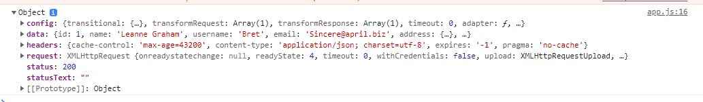
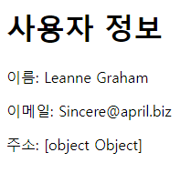
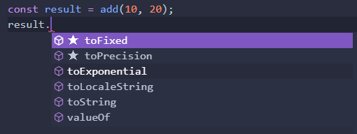
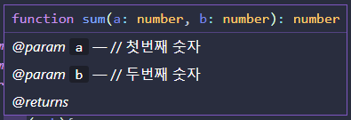

# 타입스크립트 소개와 배경

공식사이트

https://www.typescriptlang.org/

Typescript는 Type이 있는 JavaScript다.


## 타입스크립트란?

**자바스크립트에 타입을 부여한 언어**, 자바스크립트의 확장된언어.

JS와 다르게 브라우저에서 실행하기 위해 파일을 한번 변환**(compile)**해주어야 한다.

이런 변환과정을 컴파일(compile)이라 한다.


## 왜 타입스크립트를 쓰면 좋은가?

* 에러의 사전방지!
* 코드 가이드 및 자동완성 (개발 생산성 향상)

why-ts폴더의 ex참고.

```javascript
// api url
var url = 'https://jsonplaceholder.typicode.com/users/1';

// dom
var username = document.querySelector('#username');
var email = document.querySelector('#email');
var address = document.querySelector('#address');

// user data
var user = {};

function startApp() {
  axios
    .get(url)
    .then(function (response) {
      console.log(response);
      user = response.data;
      // TODO: 이름, 이메일, 주소 표시하기
    })
    .catch(function (error) {
      console.log(error);
    });
}

startApp();
```

live server를 실행하면 Object를 받아온것을 개발자도구창을 이용해 볼 수 있다.



url을 수정해서 하나만가져올수도있고, 10개를 볼 수도 있다.

```javascript
// api url
// var url = 'https://jsonplaceholder.typicode.com/users/1';
var url = 'https://jsonplaceholder.typicode.com/users';
```


name, email, address를 입력해보자.

```javascript
username.innerText = user[0].name;
email.innerText = user[0].email;
address.innerText = user[0].address;
```


이러고 결과를 보게 되면, 주소가 [Object Object]로 보이는 걸 볼 수 있다.



만약 오타를 냈다면 undefined로 보이게 되는데 이런 부분을 화면을 봐야만 알 수 있다.


## 자바스크립트에 타입이 있을 때의 첫번째 장점

화면상에서가 아닌 코드상에서 오타등의 에러를 바로 확인할 수 있다.

어떤 객체에 어떤 변수가 있다고 타입이 다 설정이 되있기 때문.

참고 : [JSDOCS][https://devdocs.io/jsdoc/]

[https://devdocs.io/jsdoc/]: https://devdocs.io/jsdoc/	"jsdocs"


## 자바스크립트에 타입이 있을 때의 두번쨰 장점

코드 자동완성.

```javascript
function sum(a,b){
  return a+b;
}
sum(10, '20'); // 1020
```

이 경우 30이 아닌 1020이 결과로 나오게된다.

js에서 sum에 마우스를 올리면 a와 b가 type이 any인걸 볼 수 있다.


```typescript
function add(a: number, b: number): number{
  return a+b;
}
// add(10, 20);
add(10, '20');
```

typescript에서는 a와 b 그리고 결과가 number로 나오는 걸 볼 수 있다.

아래 줄의 '20'의 경우 number가아니라 에러가 발생하는 것을 볼 수 있다.

이처럼 타입스크립트는 코드상에서 미리 확인할 수 있다.


또한 타입에따라 자동완성도 볼 수 있다.



이런 기능을 vsCode의 인텔리센스(Intellisense)라고 하는 기능인데 자동완성 정도로 알아두면된다.

참고 : [Intellisense][https://code.visualstudio.com/docs/editor/intellisense]


## 자바스크립트를 타입스크립트처럼 코딩하는 방법

jsdocs

```javsacript
/**
 * 
 * @param {number} a 
 * @param {number} b 
 * @returns 
 */
function sum(a,b){
  return a+b;
}

// sum(10, 20);
sum(10, '20');
```

아쉽게도 js에서는 '20'이 잘못됨을 체크가 안됨.




``` javascript
 // @ts-check
```

를 추가해서 비슷한 효과를 볼 수 있다.