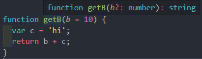
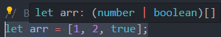

# 타입 추론 (Type Inference)

## 타입 추론 소개

타입스크립트가 어떻게 타입을 추론하는지에 대해서 알아보자.


### 타입 추론의 기본

```typescript
let x = 3;
```

**변수 선언, 초기화 / 함수의 반환 값 등을 설정할때 타입 추론이 일어남.**


```typescript
var a;
```

이렇게 선언한 경우 var a는 any타입인 것을 볼 수 있다.

intellisense: 특정 변수의 타입이나 정보들을 탕비스크립트 내부에서 해석해서 정보를 보여줌.


```typescript
function getB(b) { 
  return b;
}
```

b의 타입정의가 되어있지 않기 때문에 any타입인 것을 볼 수 있다.

```typescript
function getB(b = 10) { 
  return b;
}
```

기본 값을 설정하게 되면 number를 받아서 number를 리턴한다는 것을 볼 수 있다.

```typescript
function getB(b = 10) { 
  var c = 'hi';
  return b;
}
```

c변수를 새로 작성하면 문자열 인걸 볼 수 있고, 이렇게 작성해나가는 것이 타입추론이 일어나는 과정이라고 보면된다.

```typescript
function getB(b = 10) { 
  var c = 'hi';
  return b + c;
}
```

문자열과 숫자를 더했기 때문에  메소드의 결과는 string인걸 아래 사진 처럼 볼 수 있다.



이처럼 변수를 선언하거나, 속성 인자의 기본 값, 함수의 반환값 등을 설정할 때 타입 추론이 일어나는 것을 볼 수 있다.


## 인터페이스와 제네릭을 이용한 타입 추론 방식

```typescript
// 타입 추론 기본 2
interface Dropdown<T> { 
  value: T,
  title: string,
}
```

value는 넘어오는 타입에 따라 다르고, title은 string으로 고정.


```typescript
var shoppingItem: Dropdown<string> = {
  
}
```

인터페이스에 string을 넘겼기 때문에 value는 string이 된다.

```typescript
var shoppingItem: Dropdown<string> = {
 value 
}
```

위의 코드까지만 작성하면 value에 hover했을 때 string으로 추론 되는 것을 볼 수 있다.

제네릭을 선언 했을 때 제네릭의 값을 타입스크립트 내부적으로 추론해서 필요한 속성들의 타입을 보장해주는 걸 볼 수 있다.


## 복잡한 구조에서의 타입 추론 방식

```typescript
interface Dropdown<T> { 
  value: T,
  title: string,
}

interface DetailedDropdown<K> { 
  description: string,
  tag: K
}

var detailedItem: DetailedDropdwon < ?? > {

}
```

(보통 제네릭은 T로 사용하지만 구분을 위해 detailed에서는 K로 사용)


DetailedDropdwon에서 Dropdown을 확장하고 K를 넘겨보자.

```typescript
interface DetailedDropdown<K> extends Dropdown<K>{ 
  description: string,
  tag: K
}
```

이렇게 되면 tag도 K가 되고, K로 들어온 타입도 넘겨주기 때문에 Dropdown의 value에도 K가 된다.


```typescript
var detailedItem: DetailedDropdown<string>= {
  title: 'abc',
  description: 'ab',
  value
}
```

value가 타입추론에 의해 string인 것을 확인 할 수 있다.

```typescript
var detailedItem: DetailedDropdown<string>= {
  title: 'abc',
  description: 'ab',
  value: 'a',
  tag: 'a'
}
```

string을 number로 바꾸면, 연관이 있는 value와 tag가 에러가 발생하는 것을 볼 수 있다.


## Best Common Type(가장 적절한 타입)

어떤 타입인지 해석해나가는 방식에 대해 알아보자.

```typescript
let arr = [1, 2, true];
```

이렇게 되면 아래사진처럼 number거나 boolean인 배열로 뜬다.



```typescript
let arr = [1, 2, true, true, 'a'];
```

타입들의 가장 교집합, 흔한타입들을 **유니온방식으로 지정해나가는 방식을 best Common Type** 이라 보면된다.

=> 사용하는 타입들을 유니온으로 묶어 나가는 방식

[문맥을 이용한 타입 추론](https://joshua1988.github.io/ts/guide/type-inference.html#%EB%AC%B8%EB%A7%A5%EC%83%81%EC%9D%98-%ED%83%80%EC%9D%B4%ED%95%91-contextual-typing)


## Typescript Language Server 소개

[VSCode Typescript소개](https://code.visualstudio.com/docs/languages/typescript#_code-suggestions)

intellisense기능들 : 코드 자동완성이나 속성, api규칙 리스트 등등.

이런 기능들이 동작하려면, 내부적으로 **typescript language 서버가 돌아야한다**.

위의 링크를 참고.


node_modules - typescript폴더 - bin - tsc : 사용가능한 명령어

tsserver.js에서 내부에서 코드가 돌고 있는 것을 볼 수 있다.


추가적인 정보들은 아래의 링크를 참고해보는게 좋다.

일단은 앞으로 코드 작성 시 language서버가 돌고 있겠다 정도로 이해하면 된다.


### 참고

[VSCode Language Server Extension 가이드](https://code.visualstudio.com/api/language-extensions/language-server-extension-guide)

[Language Server 소개 사이트](https://langserver.org/)

[Language Server Protocol 개요](https://docs.microsoft.com/ko-kr/visualstudio/extensibility/language-server-protocol?view=vs-2019)
