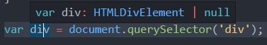

# 타입 단언

## 타입 단언 소개

```typescript
var a;
var b = 10;
```

a는 값할당도 하지 않았고, 타입지정도 하지 않았기 때문에 a는 타입이 any가 됨.

b는 10으로 값을 할당했기 때문에 number타입이 됨.


```typescript
var a;
a = 20;
a = 'a';
var b = a;
```

타입 추론 방식으로는 추론이 안되서 b 타입은 any가 된다.


```typescript
var a;
a = 20;
a = 'a';
var b = a as string;
```

**as**라는 키워드로 타입을 추정하게되면은 b의 타입이 string으로 추정됨.

이것이 바로 타입 단언.


다시 말해서 **타입스크립트보다 개발자가 타입을 더 잘 알고있다.**

타입스크립트에게 내가 정의한 타입으로 간주해라고 알리는 것.


**주로 DOM API를 조작할 때 사용.**


## 타입 단언 예제

DOM API는 주로 document. 에서 제공하는 속성들이나 api들을 말함.

쉽게 말해서 태그정보들에 접근할 수 있는 api

```typs
<div id="app">hi</div>

var div = document.querySelector('#app');
```

이 경우 div에 타입이 Element라고 되는 것을 볼 수 있다.

보통 div가 있는지 없는지 검사 후 사용하는게 일반적인 패턴임.


두 번째 프로젝트의 index.ts파일에서 아래와 같이 작성해보자.

```typescript
var div = document.querySelector('div');
```



이미지처럼 div는 null이 올수도 있다는 것을 알 수 있다.

그렇기 때문에 div.innerText를 div의 유무를 검사하지않고 바로사용하게되면, null일 수도 있다는 에러가 발생한다.


이런 경우 타입 단언을 사용한다.

```typescript
var div = document.querySelector('div') as HTMLDivElement;
div.innerText;  
```

querySelector로 찾는 div가 무조건 HTMLDivElement타입으로 있다고 단언하여 div.innerText를 바로 사용할 수 있게 된다.

