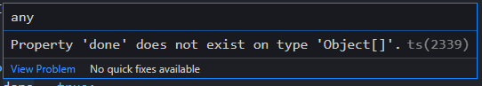

# 첫번째 프로젝트 [진행] - 할 일 관리 애플리케이션

## todoItems

```typescript
function fetchTodoItems() {
  const todos = [
    { id: 1, title: '안녕', done: false },
    { id: 2, title: '타입', done: false },
    { id: 3, title: '스크립트', done: false },
  ];
  return todos;
}
...
todoItems = fetchTodoItems();
```

fetchTodoItems를 실행했을때 return 되는 값은 객체들로 이루어진 배열이기 때문에 Array<Object> 라 선언하였다.


```typescript
let todoItems: Array<Object>;
```


## addTodo

```typescript
function addTodo(todo){
	todoItems.push(todo)
}
```

fetchTodoItems에서 todoItems가 배열안의 객체들로 이루어져있다.

그러니 push하는 todo값은 Object가 되어야 할 거 같다.


```typescript
function addTodo(todo: Object): void {
  todoItems.push(todo);
}
```


## deleteTodo

```typescript
function deleteTodo(index) {
  todoItems.splice(index, 1);
}
```

splice하는 index값은 숫자값이기 때문에 number로 지정


```typescript
function deleteTodo(index: number): void {
  todoItems.splice(index, 1);
}
```


## completeTodo

```typescript
function completeTodo(index: number, todo: Object): void {
  todo.done = true;
  todoItems.splice(index, 1, todo);
}
```

위와 똑같이 생각하여 index에 number, todo에 Object를 주었더니

todo.done에서 빨간줄이 생기며 아래와같은 에러가 발생한다.



~~무슨 이유인지 잘모르겠어서 일단 any로 변경하여 작성하였다.~~

Object대신 객체안의 타입들을 다 정의해주니 빨간줄이 삭제되었다.

```typescript
function completeTodo(index: number, todo: {id: number, title: string, done: boolean}): void {
  todo.done = true;
  todoItems.splice(index, 1, todo);
}
```


## showCompleted

```typescript
function showCompleted() {
  return todoItems.filter(item => item.done);
}
```

done에도 같은 에러가 발생했다.

filter에서 item에도 completeTodo와 같은 방식으로 객체의 타입을 선언해주었다.

```typescript
function showCompleted() {
  return todoItems.filter((item:{id: number, title: string, done: boolean}) => item.done);
}
```

참고 : https://m.blog.naver.com/rbdud96/221960116181


## addTwoTodoItems

```typescript
// TODO: 아래 함수의 내용을 채워보세요. 아래 함수는 `addTodo()` 함수를 이용하여 2개의 새 할 일을 추가하는 함수입니다.
function addTwoTodoItems(): void {
  // addTodo() 함수를 두 번 호출하여 todoItems에 새 할 일이 2개 추가되어야 합니다.
  const todo1 = {id: 4, title: '첫번째', done: false}
  const todo2 = {id: 5, title: '두번째', done: false}

  addTodo(todo1);
  addTodo(todo2);
}
```

그냥 단순히 2번의 addTodo를 실행하게 작성하였다.

들어갈 객체는 어떤걸 넣을지 몰라 임의로 하드코딩하였다.


## 결과

```typescript
let todoItems: Array<Object>;

// api
function fetchTodoItems() {
  const todos = [
    { id: 1, title: '안녕', done: false },
    { id: 2, title: '타입', done: false },
    { id: 3, title: '스크립트', done: false },
  ];
  return todos;
}

// crud methods
function fetchTodos() {
  const todos = fetchTodoItems();
  return todos;
}

function addTodo(todo: Object): void {
  todoItems.push(todo);
}

function deleteTodo(index: number): void {
  todoItems.splice(index, 1);
}

function completeTodo(index: number, todo: {id: number, title: string, done: boolean}): void {
  todo.done = true;
  todoItems.splice(index, 1, todo);
}

// business logic
function logFirstTodo() {
  return todoItems[0];
}

function showCompleted() {
  return todoItems.filter((item:{id: number, title: string, done: boolean}) => item.done);
}

// TODO: 아래 함수의 내용을 채워보세요. 아래 함수는 `addTodo()` 함수를 이용하여 2개의 새 할 일을 추가하는 함수입니다.
function addTwoTodoItems(): void {
  // addTodo() 함수를 두 번 호출하여 todoItems에 새 할 일이 2개 추가되어야 합니다.
  const todo1 = {id: 4, title: '첫번째', done: false}
  const todo2 = {id: 5, title: '두번째', done: false}

  addTodo(todo1);
  addTodo(todo2);
}

// NOTE: 유틸 함수
function log(): void {
  console.log(todoItems);
}

todoItems = fetchTodoItems();
addTwoTodoItems();
log();
```

