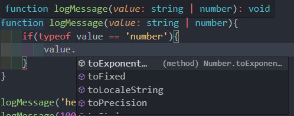
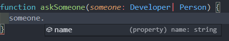

# 연산자를 이용한 타입정의

## 연산자를 이용한 타입 정의 - Union Type ( '|' )

```typescript
function logMessage(value: string) { 
  console.log(value);
}

logMessage('Hello');
logMessage(100);

```

이 경우 value위치에는 string이 와야하고, Hello의 경우 정상 동작하겠지만, 100은 숫자기 때문에 정상 동작 하지 않을 것이다.

둘 다 허용하려면, value를 any로 선언하는 방법도 있지만, 타입을 선언하는 장점을 잃는다.

타입사용의 장점을 살리면서, 이 방식을 해결할 방법을 알아보자.

```typescript

function logMessage(value: string | number){ 
  console.log(value);
}

logMessage('hello');
logMessage(100);
```

이처럼 or연산자( | )를 사용해 **유니온 타입(Union Type)**을 사용할 수 있다.

특정 타입 이상을 쓸 수 있게 하는 것이 유니온타입이라고 생각하면 된다.


## 유니온 타입의 장점

```typescript
var seho: string | number | boolean;
function logMessage(value: string | number){
    if(typeof value == 'number'){
        value. ...
    }
}
```

위 처럼 value가 숫자형으로 오게되면 그 조건문안의 if문안의 value는 number형인걸 볼 수 있다.



any로 썻을 때는 바로 추천이 되지 않는다.

하지만 타입 지정을 통해 해당 타입에 대한 api나 메소드가 지원된다.

유니온의 장점으로 이렇게 타입을 구분해 나갈 수 있다는 점이 있고, 이러한 것을 **타입가드**라 한다.

### 타입가드 

특정 타입으로 타입의 범위를 좁혀나가는(필터링 하는) 과정


## 유니온 타입의 특징

```typescript
interface Developer {
  name: string;
  skill: string;
}

interface Person { 
  name: string;
  age: number;
}

function askSomeone(someone: Developer: Person) { 

}
```

Developer와 Person에 공통으로 name이란 속성을 Developer와 person에 각 skill과 age를 선언하였다.

function askSomeone에 파라미터 someone에 유니온타입으로 Developer와 Person을 선언.


```typescript
function askSomeone(someone: Developer: Person) { 
	someone.
}
```

위와 같이 입력하면 공통속성인 name만 접근 가능하다는 것을 볼 수 있다.



햇갈릴 수 있는데, 위에서의 내용을 토대로 생각한다면, name, skill, age 모두 접근이 가능해야 할 것이다.

> 타입스크립트 관점에서는 Developer가 올수도있고, Person에도 올 수 있다.
>
> 그렇기 때문에 바로 써버리게 되면, safe하지 않다.
>
> 코드가 에러가 날 수 있다고 생각한다.
>
> 그렇기 때문에 공통(보장된)속성만 제공한다.
>
> skill이나 age에 접근하고 싶다면, 타입가드를 통해 특정 타입에 갔을 때 걸러내는 방식으로 이용해야함.


## 인터섹션 타입 소개 ( '&' )

```typescript
var seho: string | number | boolean;
var capt: string & number & boolean;
```

capt에 마우스롤 올려보면 never라고 절대 불가능한 타입이라고 나온다.

string이면서, number이면서, boolean도 만족하는 하나의 타입이라는 뜻.


```typescript
function askSomeone(someone: Developer& Person) {
  someone.name;
  someone.skill;
  someone.age;
}
```

여기서 someone을 인터섹션 타입으로 선언하였다.

someone이 타입은 name도 있고, Developer의 skill도 있고,Person의 age도있는 하나의 타입이라는 뜻.


유니온 타입의 경우 skill이나 age를 보장할 수 없어 타입가드 처리가 필요하다.

인터섹션 타입의 경우 타입가드가 필요 없다. => Developer와 Person의 속성을 모두 가지고 있기 때문.

실무에서 더 많이 쓰이는건 Union타입.


## 유니온타입과 인터섹션 타입의 차이

### 유니온

```typescript
function askSomeone(someone: Developer| Person) {
  
}

askSomeone()
```

askSomeone을 보면 someone에 Developer와 Person이라는 데이터 규격을 확인할 수 있다.


```typescript
askSomeone({name: '디벨로퍼', skill: '웹 개발'})
askSomeone({name: '캡틴', age: 100})
```

이렇게 Developer거나 Person의 형태를 주면 된다.


### 인터섹션

```typescipt
function askSomeone(someone: Developer& Person) {
  someone.name;
  someone.skill;
  someone.age;
}
askSomeone({name: '디벨로퍼', skill: '웹 개발'})
```

askSomeone에 에러가 발생한다.

someone이 인터섹션타입이기 때문에 Developer와 Person의 객체를 모두 요구한다.


```typescript
askSomeone({name: '디벨로퍼', skill: '웹 개발', age:34})
```

이렇게 age를 추가해 해결할 수 있다.