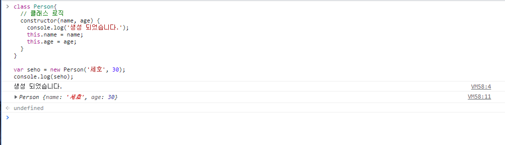
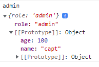

# 클래스

## 클래스 소개

클래스는 ES2015(ES6)부터 소개된 최신 문법.

```javascript
class Person{
  // 클래스 로직
  constructior(name, age) {
    console.log('생성 되었습니다.');
    this.name = name;
    this.age = age;
  }
}

var seho = new Person('세호', 30);
console.log(seho);
```

기본적 역할은 인스턴스를 만드는 것이다.


```typescript
class Person{
  // 클래스 로직
    constructor() {
        console.log('생성 되었습니다.');
      }
}
new Person();
```

class에서는 **constructor라는 초기화 메소드**를 먼저 만든다.

new Person이라는 **인스턴스를 만들었을 때** **constructor아래에 있는 로직이 수행**이 된다.

new Person을 했을 때 필요한 값들(속성, 메소드등등)을 넘겨 사용할 수 있다.

브라우저에서 실행해보자.



console.log(seho)를 하게되면, 먼저 constructor쪽 console이 실행이 되고, 

넘긴 값들이 설정되고, 생성된 Person이 출력되는 것을 볼 수 있다.


## 자바스크립트 프로토타입 소개

자바스크립트가 프로토타입 기반의 언어라는걸 알자.

https://developer.mozilla.org/en-US/docs/Web/JavaScript/Inheritance_and_the_prototype_chain

```javascript
var user = {name: 'capt', age:100};
var admin = {name: 'capt', age:100, role: 'admin'};
```

admin은 기존의 user의 속성을 붙이고, 추가정보(role)을 준 객체이다.

user에서 사용한 속성들이 admin에서 중복되는 것을 볼 수 있다.

중복되는 코드들에 대해서 줄일 수 있는 방법들이 필요하다.

그 방법이 **프로토타입을 이용한 상속 개념**이다.


```javascript
var user = {name: 'capt', age:100};
var admin = {};
admin.__proto__ = user;
```


```javascript
admin.__proto__ = user;
admin.name
admin.age
```

이 구문은 admin의 프로토타입에다가 상위의 user객체를 주겠다. (상속)라는 뜻이다.

그때부터 user에 적용된 속성들을 사용할 수 있다.

```javascript
admin.role='admin'
```

role을 주고 admin을 출력해보면 아래사진 처럼 보이고, Prototype에 user의 속성들이 들어간 것을 볼 수 있다.




## 자바스크립트 프로토 타입의 활용 사례

[MDN Object][https://developer.mozilla.org/ko/docs/Web/JavaScript/Reference/Global_Objects/Object]

```javascript
var obj = {a: 10};
Object.keys(obj);
Object.hasOwnProperty('a')
```

이렇게 Object를 선언 했을 때 Object의 메소드 keys나 hasOwnProperty등을 사용할 수 있는데,<br/>

obj를 출력해보면 Prototype에 object라고 들어간 것을 볼 수 있다.

그렇기 때문에 object의 메소드나 속성들을 사용할 수 있었던 것.

정리하자면, 이미 코딩할 때 ProtoType안에 선언했던 형태(배열이면 Array, 객체면 Object등)가 들어가 있기 때문.

이런 상위에서 제공한 api들을 **Built-in Javascript Api** 또는 **Javascript Native Api**라고 한다.

일상속에서 코딩할때 프로토타입을 사용하고 있었다는 것을 알고 있으면 됨.


## 프로토타입과 클래스와의 관계

클래스는 결국 기존 문법에서 문법의 보기좋은 코드(syntatic show)라고 보면 된다.

```javascript
function Person(name, age) { 
  this.name = name;
  this.age = age;
}
var capt = new Person('캡틴', 100);
```

위 코드와 아래 코드는 동일하다.

```javascript
class Person{
  // 클래스 로직
  constructor(name, age) {
    console.log('생성 되었습니다.');
    this.name = name;
    this.age = age;
  }
}

var seho = new Person('세호', 30);
console.log(seho);
```

생성자함수를 클래스를 이용하지 않고도 만들어 나갈수 있다.


## 타입스크립트의 클래스 문법

```typescript
class Person { 
  constructor(name, age) {
    this.name = name;
    this.age = age;
  }
}
```

ts파일을 만들고 그대로 입력하게 되면, 타입스크립트이기에 나타나는 에러를 볼 수 있다.

마우스를 올려보면, Person형식에 name속성이 없다고 뜬다.

js에서는 그냥 constructor를 사용했지만, **타입스크립트에서는 클래스에서 사용할 멤버변수를 다 선언해주어야함.**

그리고, 파라미터에 대한 타입 또한 설정이 가능하다.

```typescript
class Person { 
  name: string;
  age: number;
  constructor(name: string, age:number) {
    this.name = name;
    this.age = age;
  }
}
```

그 다음 멤버변수의 유효범위에 대해서도 설정이 가능하다.

클래스 안에서만 사용하려면 private, 기본적으론 public, 또 protected 등등 사용이 가능하다.

```typescript
class Person { 
  private name: string;
  public age: number;
  readonly log: string;
  
  constructor(name: string, age:number) {
    this.name = name;
    this.age = age;
  }
}
```

