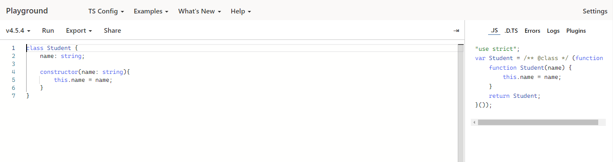

# 타입스크립트 시작하기

## 타입스크립트 프로젝트 시작하는 방법(라이브러리 설치와 TSC)

```typescript
function sum(a: number, b:number): number {
  return a + b;
}

sum(10,20);
```

아직까지는 브라우저가 ts파일을 인식할 수 없다.

**컴파일(ts -> js로 변환)이 필요**함.

```shell
node -v
```

으로 버전먼저 확인!


```shell
npm i typescript -g
```

로 설치.


```shell
tsc index.ts
```

를 사용하여 index.js가 만들어지는 것을 볼 수 있다.


### 변환된 js파일

```javascript
function sum(a, b) {
    return a + b;
}
sum(10, 20);
```


## 타입스크립트 설정 파일

tsc명령어를 사용할 때 부가적인 옵션을 적용 할 수 있다.

tsconfig.json을 만들어 key: value 형태로 작성함.

```json
{
  "compilerOptions": {
    "allowJs": true, // 이 프로젝트안에 JS를 허용
    "checkJs": true, // @ts-check역할
    "noImplicitAny": true // 모든 타입에대해서 최소한 any라도 넣어야한다고 설정
  }
}
```

참고 : [설정 옵션(공식문서)][https://www.typescriptlang.org/docs/handbook/compiler-options.html]


## 타입스크립트 플레이그라운드 사이트 소개

[플레이그라운드][https://www.typescriptlang.org/play]


[바벨][https://babeljs.io/]

최대한 많은 브라우저에서 동작할수 있게 변환 해줌.


class를 입력하고, TS Config에서 target을 ES5로 바꾸면 해당 코드가 어떻게 바뀌는지 볼 수 있다.

