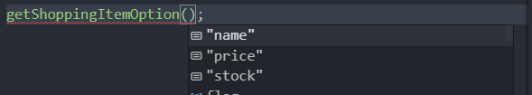

# 제네릭

## 제네릭 소개

언어에서 재사용성이 높은 컴포넌트를 만들 때 자주 활용되는 특징

한가지 타입보다 여러 가지 타입에서 동작하는 컴포넌트를 생성하는데 사용

[제네릭 교안 참고][https://joshua1988.github.io/ts/guide/generics.html]

**<T>**

```typescript
function logText<T>(text: T): T{
    return text;
}
```

위 처럼 <>안에 T가 들어간 형태.

**타입을 마치 함수의 파라미터 형태로 받게 되는게 제네릭**이다.


## 제네릭의 기본 문법

```javascript
function logText(text) { 
  console.log(text);
  return text;
}

logText(10); // 숫자 10
logText('Hello'); // 문자열 Hello
logText(true); // 진위값 true
```

현재 타입을 지정하지 않았기 때문에 어떤 형태든 올 수 있다.

현재 logText함수는 파라미터를 받아 그대로 파라미터를 반환하는 형태다.


제네릭을 바로 써보자.

```typescript
function logText<T>(text: T): T{
    console.log(text);
	return text;    
}
```

이처럼 사용하게 되면 이제 logText를 **호출할때 타입을 넘겨 주게 정의**할 수 있다.

```typescript
logText<string>('하이');
```

이렇게 사용하면, 파라미터 text의 타입은 하이라는 문자열이 됨.


## 기존 타입 정의 방식과 제네릭의 차이 - 함수 중복 선언의 단점

### 함수 중복 선언의 단점

```typescript
function logText(text){ 
  console.log(text);
  return text;
}

logText('a');
logText(10);
logText(true);
```

현재 text는 암묵적으로 타입이 any이다.


```typescript
function logText(text: string){ 
  console.log(text);
  text.split('').reverse().join('');
  return text;
}
```

이렇게 되버리면, text는 문자열이 되야만 하기 때문에 나머지 10과 true는 에러가 발생.

숫자형과 boolean도 받고 싶다면 새로운 메소드를 생성해야함.

단순히 타입을 가르기 위해서 메소드를 하나 더 만들어야하는게 코드가 더 비대해지기 때문에 유지보수측면에서 좋지않다.


## 기존 타입 정의 방식과 제네릭의 차이 - 유니온 타입을 이용한 선언 방식의 문제점

###  유니온 타입을 이용한 선언 방식의 문제점

유니온 사용

```typescript
function logText(text: string | number) { 
  console.log(text);
  return text;
}
```

이렇게 string과 number둘 다 받을수 있게 된다.

당장 해당 문제는 해결된다.

하지만, logText안에서 text.을 하고 preview를 보게 되면 string과 number둘 다 사용할 수 있는 경우만 뜨게된다.


```typescript
const a = logText('a');
a.split('');
```

이 경우 에러가 발생한다. number에서는 split이 사용이 안되기 때문에 타입이 명확하지 않아 발생.


## 제네릭의 장점과 타입추론에서의 이점

 ```typescript
 function logText<T>(text: T): T { 
   console.log(text);
   return text;
 }
 ```

* logText 함수에서 제네릭 타입을 받고, `logText<T>`

* 함수를 정의 할 때 받은 타입을 파라미터의 타입으로 사용하겠다. `(text: T)`

* 리턴도 그대로 받은 타입을 쓰겠다. : `T{...}`

```typescript
logText<string>();
```

logText를 **호출할 때** `<string>`은 **string으로 타입을 사용하겠다고 선언**하는 것.


```typescript
const str = logText<string>('abc');
str.split('');
```

호출시 타입 선언을 통해 typescript도, 사용자도 str이 문자열인걸 알고, split을 사용할 수 있게됨.


```typescript
const flag = logText<boolean>(true);
```

위 처럼 boolean타입도 호출 시 선언할 수 있다.

제네릭은 기존에 타입별로 메소드를 선언 했던게, 하나로 줄일 수 있으며,  **타입 정의에 대한 이점**을 가져간다.


## 제네릭 실전 예제 살펴보기 - 예제 설명

dropdown-genric.html , ts파일


예제에서 html파일의 option부분은 보통 반복해서 데이터를 출력하기 때문에 주석처리.

### 목록 데이터

```typescript
const emails = [
  { value: 'naver.com', selected: true },
  { value: 'gmail.com', selected: false },
  { value: 'hanmail.net', selected: false },
];

const numberOfProducts = [
  { value: 1, selected: true },
  { value: 2, selected: false },
  { value: 3, selected: false },
];
```


### createDropdownItem

```typescript
function createDropdownItem(item) {
  const option = document.createElement('option');
  option.value = item.value.toString();
  option.innerText = item.value.toString();
  option.selected = item.selected;
  return option;
}
```

목록(item)을 받아서 option태그를 만들어서 리턴.


### 반복

```typescript
// NOTE: 이메일 드롭 다운 아이템 추가
emails.forEach(function (email) {
  const item = createDropdownItem(email);
  const selectTag = document.querySelector('#email-dropdown');
  selectTag.appendChild(item);
});
```


## 제네릭 실전 예제 살펴보기 - 코드에 타입 정의 하기

### emails

```typescript
const emails = [
  { value: 'naver.com', selected: true },
  { value: 'gmail.com', selected: false },
  { value: 'hanmail.net', selected: false },
];
```

emails는 객체로 이루어진 배열.

{}[]도 동작을하지만, object선언 시 구체적일 필요가 있다.

```typescript
const emails: { value: string; selected: boolean}[] = [...]
```


### numberOfProducts

위와 동일하게 처리.

```typescript
const numberOfProducts: { value: number; selected: boolean}[] = [...]
```


### createDropdownItem

```typescript
function createDropdownItem(item) {
  const option = document.createElement('option');
  option.value = item.value.toString();
  option.innerText = item.value.toString();
  option.selected = item.selected;
  return option;
}
```

파라미터 item에 대한 타입 정의가 필요하다.


email만 생각하고, 

```typescript
function createDropdownItem(item: { value: string; selected: boolean}) { ... }
```

처럼 작성 후 저장해도 에러는 발생하지 않지만, value는 number도 올 수 있다.

number하게 되면 아래쪽 반복문에서 에러가 발생.


### 인터페이스 + 유니온 활용

```typescript
interface Email { 
  value: string;
  selected: boolean;
}

const emails: Email[] = [
  { value: 'naver.com', selected: true },
  { value: 'gmail.com', selected: false },
  { value: 'hanmail.net', selected: false },
];

interface ProductNumber { 
  value: number;
  selected: boolean;
}

const numberOfProducts: ProductNumber[] = [
  { value: 1, selected: true },
  { value: 2, selected: false },
  { value: 3, selected: false },
];

function createDropdownItem(item: Email | ProductNumber) {
  const option = document.createElement('option');
  option.value = item.value.toString();
  option.innerText = item.value.toString();
  option.selected = item.selected;
  return option;
}

// NOTE: 이메일 드롭 다운 아이템 추가
emails.forEach(function (email) {
  const item = createDropdownItem(email);
  const selectTag = document.querySelector('#email-dropdown');
  selectTag.appendChild(item);
});

numberOfProducts.forEach(function (product) { 
  const item = createDropdownItem(product);
})
```

Email과 ProductNumber에 대한 인터페이스를 생성하고, 아래에서 두가지 경우를 사용할 수 있다고 유니온타입으로 선언하면 사용이 가능하다.

하지만 타입 정의에 대한 코드가 늘어나게 된다.

동일한 속성에 대해서, 각 타입이 달라 하나씩 더 선언해서 코드가 늘어남.


## 인터페이스에 제네릭을 선언하는 방법

```typescript
// 인터페이스에 제네릭을 선언하는 방법
interface Dropdown { 
  value: string;
  selected: boolean;
}
```


```type
interface Dropdown<T> { 
  value: T;
  selected: boolean;
}
```

interface를 Dropdown의 인터페이스의 타입을 받아오는 걸로 사용하겠다.는 뜻


```typescript
interface Dropdown<T> { 
  value: T;
  selected: boolean;
}
const obj: Dropdown = {value: 'abc', selected: false};
```

이렇게 되면 Dropdown에 제네릭타입이 하나 필요하다고 빨간줄이 생김.

특정 속성에 대한 타입을 무조건 해야되는데 안했다는 것.

```typescript
const obj: Dropdown<string> = {value: 'abc', selected: false};
// const obj: Dropdown<number> = {value: 'abc', selected: false};
```

이렇게 string이나 number을 사용하겠다고 선언이 가능.


## 제네릭 실전 예제 살펴보기 - 제네릭을 이용한 타입 정의

기존에 만들었던 Email과 ProductNumber 인터페이스를 제네릭타입을 이용해 하나로 합쳐서 사용해보자.

```typescript
interface DropdonwItem<T> { 
  value: T; 
  select: boolean;
}
// DropdownItem<string>
// DropdownItem<number>
```

DropdownItem을 사용하는 곳에서 타입을 지정해 사용하면 된다.

이렇게 제네릭을 이요해 두가지 타입을 커버하는 것을 볼 수 있다.


### 유니온 제거

```typescript
function createDropdownItem<T>(item: DropdownItem<T>) {
  const option = document.createElement('option');
  option.value = item.value.toString();
  option.innerText = item.value.toString();
  option.selected = item.selected;
  return option;
}

// NOTE: 이메일 드롭 다운 아이템 추가
emails.forEach(function (email) {
  const item = createDropdownItem<string>(email);
  const selectTag = document.querySelector('#email-dropdown');
  selectTag.appendChild(item);
});

```

const item에서 타입을 선언해 넘겨 유니온을 제거할 수 있다.


## 제네릭의 타입 제한

```typescript
// 제네릭의 타입 제한
function logTextLegnth<T>(text: T): T{ 
  console.log(text.length);
  return text;
}

logTextLength('hi');
```

이러면 text.length에 에러가 뜨는 것을 볼 수 있다. => `제네릭 T에 length가 없다.`라고 뜬다.

typescript 입장에서 logTextLength안에 어떤 타입이 올지 모르기 때문!

 

```typescript
// 제네릭의 타입 제한
function logTextLength<T>(text: T[]): T[]{ 
  console.log(text.length);
  text.forEach(function (text) { 
    console.log(text);
  })
  return text;
}

logTextLength<string>(['hi']);
```

이렇게 text에 배열이 온다고 **타입 힌트를 줄 수 있다.**


## 정의된 타입으로 타입을 제한하기

```types
// 제네릭의 타입 제한 2 - 정의된 타입 이용하기
interface LengthType {
  length: number;
}
function logTextLength<T>(text: T): T[]{ 
  text.length;
  return text;
}
```

이 경우 아까 위의 처음 경우처럼 length를 바로 사용할 수 없다.

**! 제네릭타입에 extends를 이용해 사용할 수 있다.** 


```typescript
// 제네릭의 타입 제한 2 - 정의된 타입 이용하기
interface LengthType {
  length: number;
}
function logTextLength<T extends LengthType>(text: T): T{ 
  text.length;
  return text;
}
```

제네릭으로 받은 타입은 항상 LengthType하위타입일 것이기 때문에, <br/>logTextLength에서는 LengthType은 무조건 있고, 추가로 작성할 수 있다. 고 제한을 줄 수 있다.


```typescript
logTextLength('a')
// logTextLength(10)''
logTextLength({ length: 10 });
// logTextLength({ lengt: 10 });
```

10의 경우 number라 length가 없기 때문에 에러.

{lengt: 10}은  length가 없기 때문에 length가 필요하다고 에러.


## keyof로 제네릭의 타입 제한하기

```typescript
interface ShoppingItem { 
  name: string;
  price: number;
  stock: number;
}

function getShoppingItemOption() { 

} 
```

getShoppingItemOption함수에서 name, price, stock중 하나만 사용하겠다고 제한 할 수 있다.

```typescript
getShoppingItemOption(10);
getShoppingItemOption<string>('a');
```

이처럼 아무 값이나 다 들어올 수 있다.


interface 값중 한가지 속성만 받거나 ShoppingItem에 있는 속성들만 받겠다고 제한 해보자.

```typescript
function getShoppingItemOption<T extends keyof ShoppingItem>(itemOption: T): T { 
  return itemOption;
} 
```

**extends와 keyof를 이용**할 수 있다.

**ShoppingItem의 키들 중 한가지가 바로 T가 된다는 뜻.**


```typescript
getShoppingItemOption(10);
getShoppingItemOption<string>('a');
```

이 경우 name, price, stock중 한가지 형태로만 받을 수 있다고 에러가 뜬다.


```typescript
getShoppingItemOption("price");
```

키값들만 사용할 수 있게 keyof로 제한을 둠.



