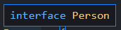

# 타입 별칭

## 타입 별칭 소개

타입별칭은 특정 타입이나 인터페이스를 참조할 수 있는 타입변수를 의미.

```typescript
// string 타입을 사용할 때
const name: string = 'capt';

// 타입 별칭을 사용할 때
type MyName = string;
const name: MyName = 'capt';
```

interface 레벨의 복잡한 타입에도 별칭을 사용할 수 있다.

```typescript
type Developer = {
    name: string,
    skill: string,
}
```

타입별칭에 제네릭도 사용 가능.

```typescript
type User<T> = {
    name: T
}
```


## 타입 별칭 코드 예제

타입별칭을 사용하기 위해서는 **type**이라는 키워드를 사용.

```typescript
interface Person {
  name: string;
  age: number;
}

type Person = {
  name: string;
  age: number;
}
```

두 개의 차이를 보자.

### 인터페이스 사용.

```typescript
var seho: Person = {

}
```

먼저 type을 주석처리하고, 이 상태일때 Person에 마우스를 올리면 단순히 아래 사진처럼 interface라고만 나옴




```typescript
var seho: Person = {
  name: '세호',
  age: 30
}
```

이처럼 작성한 것이 인터페이스를 이용한 타입선언이라 한다.


### 타입별칭 사용

```typescript
var seho: Person = {

}
```

타입별칭의 경우 Person이란 type의 모습을 바로 볼 수 있다.


타입이 사용되는 곳이면 어디서든지 이름을 부여하여 사용할 수 있다.

```typescript
type MySTring = string;
const str: MyString = 'hello';
```

이전 Todo예제에서 타입별칭을 사용할 수 있다.

```typescript
type Todo = { id: string, title: string, done: boolean};
function getTodo(todo: Todo){
  ...
}
```


## 타입 별칭과 인터페이스의 차이점

타입별칭은 새로운 타입 값 하나 생성하는게 아니라 정의한 타입에 대해 나중에 쉽게 참고할 수 있게 이름을 부여하는 것과 같다.

위의 사진들과 같이 VSCode사으이 프리뷰 상태로 다른 타입과 어떤 차이점이 있는지 확인 할 수 있다.


특정 타입에 대해 가리키는 별칭을 제공한다.


가장큰 특징은 **! 타입의 확장 가능 / 불가능** 입니다.

인터페이스는 확장이 가능하지만 type은 불가능하다.

=> 그래서 가능한 type보다는 interface로 선언해 사용하는 것을 추천. (공식문서).

좋은 소프트웨어는 확장이 용의 해야한다는 원칙 참고.