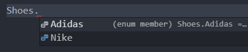

# 이넘

## 이넘소개

이넘은 **특정 값들의 집합**을 의미하는 자료형.

정해져 있는 목록의 값들을 지정할 때 enum을 사용.


## 숫자형 이넘

```typescript
enum Shoes { 
  Nike,
  Adidas,
}

var myShoes = Shoes.
```

enum Shoes를 선언하고 myShoes를 선언하면 Shoes에서 Nike, Adidas가 출력되는걸 볼 수 있다.




```type
var myShoes = Shoes.Nike;
console.log(myShoes); // 0
```

별도의 값을 지정하지않으면 숫자형 이넘으로 지정되는걸 볼 수 있다.

Nike - 0, Adidas - 1 인걸 볼 수 있다.

하나씩 늘어날 때 마다 1씩 증가.


## 문자형 이넘

```typesc
enum Shoes { 
  Nike = '나이키',
  Adidas = '아디다스',
}

var myShoes = Shoes.Nike;
console.log(myShoes); // '나이키'
```

PlayGround에서 확인해보자.


## 이넘 활용 사례

```typescript
// 예제
function askQuestion(answer: string) { 
  if (answer == 'yes') { 
    console.log('정답입니다.')
  }
  if (answer == 'no') { 
    console.log('오답입니다.')
  }
}
```


```typescript
askQuestion('예스');
askQuestion('y');
askQuestion('Yes');
```

위처럼 정답에 대한 여러가지 경우가 올 수 있다. 

이런 것들을 구체적인 값으로 제한하는게 enum이다.

지금은 answer가 string이라 아무거나 올 수 있다.


enum으로 선언해보자.

```typescript
enum Answer { 
  Yes = 'Y',
  No = 'N',
}

function askQuestion(answer: Answer) { 
  if (answer == Answer.Yes) { 
    console.log('정답입니다.')
  }
  if (answer == Answer.No) { 
    console.log('오답입니다.')
  }
}
```


```
askQuestion('예스');
askQuestion('y');
askQuestion('Yes');
```

이제는 이경우 에러가 발생한다.

```typescript
askQuestion(Answer.Yes);
```

answer를 Answer로 선언했기 때문에 enum Answer에서 제공하는 데이터 형태만 허용한다.

enum으로 선언하게 되면 enum에서 제공하는 형태로만 가능하다.