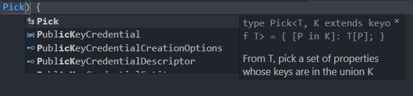
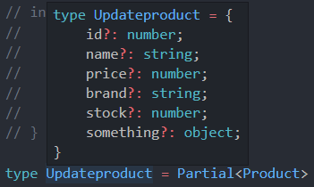

# 고급 타입

## 유틸리티 타입 소개

[핸드북 유틸리티 타입](https://joshua1988.github.io/ts/usage/utility.html)

유틸리티 타입은 이미 정의해 놓은 타입을 변환할 때 사용하기 좋은 타입 문법. (api성 타입)

유틸리티 타입을 꼭 쓰지 않더라도 기존의 인터페이스, 제네릭 등의 기본 문법으로 충분히 타입 변환이 가능하지만, **유틸리티 타입을 쓰면 훨씬 간결한 문법으로 타입을 정의 할 수 있다.**

보통 제네릭 타입이라고도 많이 이야기 함.


### 자주 사용되는 유틸리티 타입

[자주 사용되는 유틸리티 타입](https://joshua1988.github.io/ts/usage/utility.html#자주-사용되는-유틸리티-타입-몇-개-알아보기)

* **Partial** : 특정 타입의 **부분 집합을 만족하는 타입을 정의**할 수 있다.

  ```typesciript
  nterface Address {
    email: string;
    address: string;
  }
  
  type MayHaveEmail = Partial<Address>;
  const me: MayHaveEmail = {}; // 가능
  const you: MayHaveEmail = { email: 'test@abc.com' }; // 가능
  const all: MayHaveEmail = { email: 'capt@hero.com', address: 'Pangyo' }; // 가능
  ```

  특정 인터페이스( Address )를 만족하는 부분 객체 모습들을 반환 받을 수 있다.

* **Pick** : 특정 타입에서 **몇 개의 속성을 선택(pick)하여 타입을 정의**

  ```typescript
  interface Hero {
    name: string;
    skill: string;
  }
  const human: Pick<Hero, 'name'> = {
    name: '스킬이 없는 사람',
  };
  ```

  ```typescript
  type HasThen<T> = Pick<Promise<T>, 'then' | 'catch'>;
  let hasThen: HasThen<number> = Promise.resolve(4);
  hasThen.th // 위에서 'then'만 선택하면 'then'만 제공, 'catch' 선택하면 'catch만 제공'
  ```

* **Omit** : 특정 타입에서 **지정된 속성만 제거한 타입을 정의**

  ```typescript
  interface AddressBook {
    name: string;
    phone: number;
    address: string;
    company: string;
  }
  const phoneBook: Omit<AddressBook, 'address'> = {
    name: '재택근무',
    phone: 12342223333,
    company: '내 방'
  }
  const chingtao: Omit<AddressBook, 'address'|'company'> = {
    name: '중국집',
    phone: 44455557777
  }
  ```

  

## 유틸리티 타입 사례 - Pick

```typescript
interface Product { 
  id: number;
  name: string;
  price: number;
  brand: string;
  stock: number;
}
// 상품 목록을 받아오기 위한 API 함수
function fetchProducts(): Promise<Product[]>{ 
  // ... 
}
```

여기서 상세 정보 조회를 할 때 id, name, price만 들고온다고 가정해보자.

```typescript
// 상품의 상세 
function displayProductDetail(shoppingItem: {id: number, name: string, price: number}) { 

}
```

이런 경우 Product를 그대로 재활용이 힘들다. Product의 일부만 가지고 화면을 그려야 한다.


```typescript
interface ProductDetail { 
  id: number;
  name: string;
  price: number;
}

// 상품의 상세 
function displayProductDetail(shoppingItem: ProductDetail) { 
 // ...
}
```

기존 방식대로 한다면, detail 인터페이스를 만들어서 사용했다.

하지만 이런 방식이 계속된다면 중복된 코드들이 계속 생길 것이다.

Pick을 이용하여 Product의 일부만 뽑아보자.




```typescript
Pick<Product, 'id' | 'name' | 'price'>
```

Pick의 첫번째 인자는 타겟, 두번째 인자는 어떤걸 뽑아올건지에 대한 정보이다.

위의 코드는 Product에서 id,name,price를 뽑은 것이 shoppingItem이다 라는 뜻.


```typescript
type ShoppingItem = Pick<Product, 'id'|'name'|'price'>

// 상품의 상세 
function displayProductDetail(shoppingItem: ShoppingItem) { 
 // ...
}
```


## Omit타입과 기타 유틸리티 타입 목록 소개

[타입스크립트 공식 사이트의 유틸리티 타입 문서](https://www.typescriptlang.org/docs/handbook/utility-types.html)

Pick과는 반대로 지정된 속성만 제거하고, 나머지를 쓰겠다는 것이다.


### 유틸리티 타입 목록

- [Partial](https://www.typescriptlang.org/docs/handbook/utility-types.html#partialtype)
- [Required](https://www.typescriptlang.org/docs/handbook/utility-types.html#requiredtype)
- [Readonly](https://www.typescriptlang.org/docs/handbook/utility-types.html#readonlytype)
- [Record](https://www.typescriptlang.org/docs/handbook/utility-types.html#recordkeys-type)
- [Pick](https://www.typescriptlang.org/docs/handbook/utility-types.html#picktype-keys)
- [Omit](https://www.typescriptlang.org/docs/handbook/utility-types.html#omittype-keys)
- [Exclude](https://www.typescriptlang.org/docs/handbook/utility-types.html#excludeuniontype-excludedmembers)
- [Extract](https://www.typescriptlang.org/docs/handbook/utility-types.html#extracttype-union)
- [NonNullable](https://www.typescriptlang.org/docs/handbook/utility-types.html#nonnullabletype)
- [Parameters](https://www.typescriptlang.org/docs/handbook/utility-types.html#parameterstype)
- [ConstructorParameters](https://www.typescriptlang.org/docs/handbook/utility-types.html#constructorparameterstype)
- [ReturnType](https://www.typescriptlang.org/docs/handbook/utility-types.html#returntypetype)
- [InstanceType](https://www.typescriptlang.org/docs/handbook/utility-types.html#instancetypetype)
- [ThisParameterType](https://www.typescriptlang.org/docs/handbook/utility-types.html#thisparametertypetype)
- [OmitThisParameter](https://www.typescriptlang.org/docs/handbook/utility-types.html#omitthisparametertype)
- [ThisType](https://www.typescriptlang.org/docs/handbook/utility-types.html#thistypetype)
- [Intrinsic String Manipulation Types](https://www.typescriptlang.org/docs/handbook/utility-types.html#intrinsic-string-manipulation-types)
- [Uppercase](https://www.typescriptlang.org/docs/handbook/utility-types.html#uppercasestringtype)
- [Lowercase](https://www.typescriptlang.org/docs/handbook/utility-types.html#lowercasestringtype)
- [Capitalize](https://www.typescriptlang.org/docs/handbook/utility-types.html#capitalizestringtype)
- [Uncapitalize](https://www.typescriptlang.org/docs/handbook/utility-types.html#uncapitalizestringtype)


## 유틸리티 타입 사례 - Partial

상품의 정보를 Update(갱신)할 때.

```typescript
interface Product { 
  id: number;
  name: string;
  price: number;
  brand: string;
  stock: number;
  something: object;
}
```

위의 속성중에서 만약 어떤게 와도 update할 수 있다고 가정해보자. 

그러면 어떤게 와도 다 받을 수 있게 바꿔줘야 함.

```typescript
interface Product { 
  id?: number;
  name?: string;
  price?: number;
  brand?: string;
  stock?: number;
}
```

이 속성들이 optional로 들어갈 수 있게 할 수도 있다.

위에 타입이 정의 되있는데 불필요하게 한번 더 정의 하고 있다.

Partial을 사용하면 똑같은 효과로 사용할 수 있다.

```typescript
type ShoppingItem = Pick<Product, 'id'|'name'|'price'>
function displayProductDetail(shoppingItem: ShoppingItem) { 
 // ...
}
```



Updateproduct가 똑같은 효과를 보여주고 있는걸 볼 수 있다.


## 유틸리티 타입 구현

### Partial

우선 Partial의 코드형태를 보자.

```typescript
type Partial<T> = {
    [P in keyof T]?: T[P];
};
```


예제로 UserProfile 인터페이스를 만들고, Update시 사용할 Update인터페이스를 만들어 보자.

```typescript
// 4. 유틸리티 타입 구현하기 - Partial
interface UserProfile { 
  username: string;
  email: string;
  profilePhotoUrl: string;
}
```

```typescript
interface UserPrfileUpdate { 
  username?: string;
  email?: string;
  profilePhotoUrl?: string;
}
```

위에서 설명했듯이 코드 중복이 일어난다.

UserProfile을 재활용하여 사용할 수 있다.


### Partial이 만들어 지는 과정

#### #1

UserPrfileUpdate를 타입으로 정의 해보자.

```typescript
type UserProfileUpdate = {
  username: 
  email: 
  profilePhotoUrl: 
}
```

Update의 속성들은 UserProfile에 정의 되있고, UserProfile의 속성으로 접근하면 타입이 나올것이다.

```typescript
type UserProfileUpdate = {
  username?: UserProfile['username'];
  email?: UserProfile['email'];
  profilePhotoUrl?: UserProfile['profilePhotoUrl'];
}
```

위의 옵셔널을 준 interface UserProfileUpdate와 동일한 구조를 가지게 되었다.


#### #2

key를 접근해서 왼쪽의 값들로 매겨주겠다고 볼 수 있다.

반복문을 사용해 2차로 코드를 줄여보자.

```typescript
type UserProfileUpdate = {
  [p in 'username' | 'email' | 'profilePhotoUrl']?: UserProfile[p]
}
```

이게 바로 맵드 타입(Mapped Type)이라고 하는데 후에 알아보자.


#### #3

위에서 사용한 `'username' | 'email' | 'profilePhotoUrl'` 이 부분에 keyof를 사용할 수 있다.

```typescript
type UserProfileUpdate = {
  [p in keyof UserProfile]?: UserProfile[p]
}
```

여기서 사용한건 UserProfile에 한정된 것이다.


**타입을 넘겨받는 형태가 되려면 제네릭을 사용하면 된다!**


#### #4

```typescript
type Subset<T> = {
  [p in keyof T]?: T[p]
}
```

아까 시작할 때 보았던 Partial과 동일한 형태가 되었다.


## 유틸리티 타입 구현 내용 정리

```typescript
// 4. 유틸리티 타입 구현하기 - Partial
interface UserProfile { 
  username: string;
  email: string;
  profilePhotoUrl: string;
}

// #0
// interface UserPrfileUpdate {
//   username?: string;
//   email?: string;
//   profilePhotoUrl?: string;
// }

// #1
// type UserProfileUpdate = {
//   username?: UserProfile['username'];
//   email?: UserProfile['email'];
//   profilePhotoUrl?: UserProfile['profilePhotoUrl'];
// }


// #2
// type UserProfileUpdate = {
//   [p in 'username' | 'email' | 'profilePhotoUrl']?: UserProfile[p]
// }
// type UserProfileKeys = keyof UserProfile;


// #3
type UserProfileUpdate = {
  [p in keyof UserProfile]?: UserProfile[p]
}

// #4
type Subset<T> = {
  [p in keyof T]?: T[p]
}
```

* #0<br/>interface가 가지고 있는 속성을 그대로 복사하여 옵셔널을 주게 된다면, 필요없는 중복정의 되면서, 코드의 중복이 일어난다.
* #1<br/>이미 정의된 타입을 이용해 type별칭을 사용하여 최대한 활용.
* #2<br/>맵드 타입이란 형태로 코드를 줄임<br/>속성들을 반복하면서 대입
* #3<br/>각 속성들이 keyof를 사용한 형태이기 때문에 keyof를 사용해 다시한번 줄임
* #4<br/>최종적으로 UserProfile뿐만 아니라 다른 타입을 넘겨 받기 위해 제네릭을 사용.


