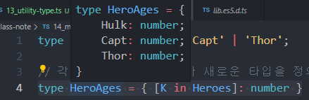

# 맵드 타입(Mapped Type)

## 맵드 타입 소개

[맵드 타입](https://joshua1988.github.io/ts/usage/mapped-type.html)

**맵드 타입**이란 기존에 정의되어 있는 타입을 새로운 타입으로 변환해주는 문법을 의미.

자바스크립트 **`map()` API함수를 타입에 적용한 것과 같은 효과**.<br/>(map함수는 배열의 값을 조작 해 새로운 배열을 리턴하는 함수)


### 맵드 타입의 기본 문법

map함수를 타입에 적용했다고 보면됨.

```typescript
{ [ P in K ] : T }
{ [ P in K ] ? : T }
{ readonly [ P in K ] : T }
{ readonly [ P in K ] ? : T }
```

[ ]안에 in을 사용해 제네릭과 조합해서 사용.

```typescript
{ [ 타입변수 in 제네릭 ]: Type }
```


참고

[Mapped Type Proposal 깃헙 PR](https://github.com/Microsoft/TypeScript/pull/12114)


## 맵드 타입 예제

```typescript
type Heroes = 'Hulk' | 'Capt' | 'Thor';
```

여기서 각 이름을 key로 받아 age를 number로 받는 새로운 타입을 정의해보자.

```typescript
type HeroAges = { [K in Heroes]: number }
```



HeroAges에 각 이름들이 키로들어가고, number타입이 지정된 걸 볼 수 있다.

```typescript
const ages: HeroAges = {
  Hulk: 33,
  Capt: 100,
  Thor: 1000,
}
```

이 처럼 사용 할 수 있다.

