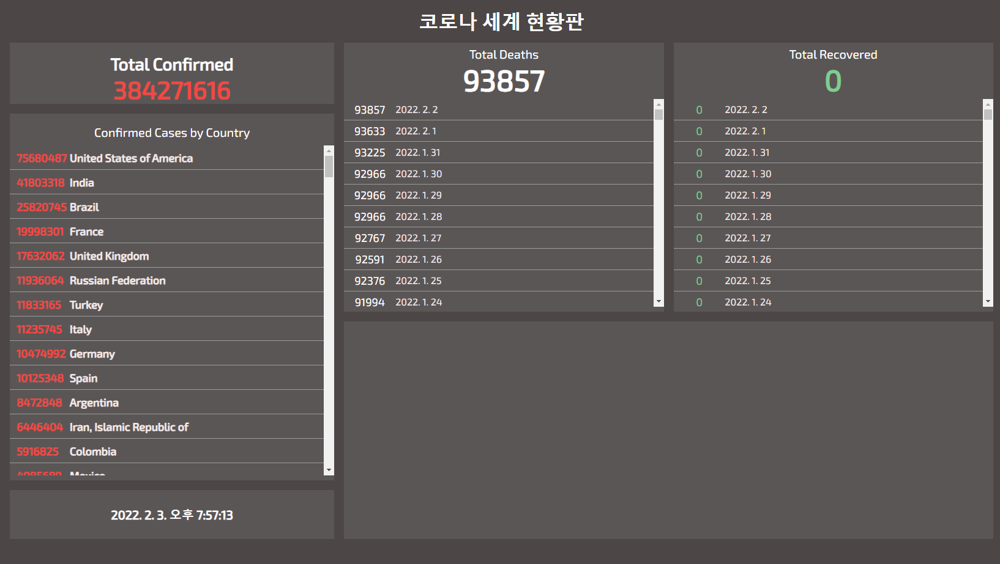

# 최종 프로젝트 안내

## 최종 프로젝트에서 다룰 사이트 소개

project폴더

Live Server 이용

### 참고 사이트

[존스 홉킨스 대학 코로나 세계 현황판](https://www.arcgis.com/apps/dashboards/bda7594740fd40299423467b48e9ecf6)

### 시작화면

## API 문서 및 레퍼런스 사이트 안내

[Covid 19 API 문서 - Postman](https://documenter.getpostman.com/view/10808728/SzS8rjbc?version=latest#00030720-fae3-4c72-8aea-ad01ba17adf8)

[Postman Covid 19 API 안내 센터](https://covid-19-apis.postman.com/)

## 프로젝트 소스 안내 및 JS에 TS를 적용할 때 주의점

* 기능적인 변경은 절대 하지 않을 것  타입을 안전하게 만든 상태에서 기능을 변경해야함.
* 테스트 커버리지가 낮을 땐 함부로 타입스크립트 적용하지 않을 것  test코드가 없더라도 점진적으로 적용.
* 처음부터 타입을 엄격하게 적용하지 않을 것 ( 점진적으로 strict 레벨을 증가 )

### 자바스크립트 프로젝트에 타입스크립트 적용하는 절차

> TIP
>
> TLDR
>
> 1. 타입스크립트 환경 설정 및 ts 파일로 변환
> 2. any 타입 선언
> 3. any타입을 더 적절한 타입으로 변경

## 프로젝트 구조 및 소스 코드 설명

### html

1개의 header와 main태그에 - left-panel / right-panel로 구성.

axios와 chart.js를 사용

### app.js

함수와 변수만 선언되있는 상태.

함수도 IIFE(Immediately Invoked Function Expression)-즉시 실행함수를 사용해 모듈화도 하지않음.

### 시작하기전 참고!

[IIFE MDN문서](https://developer.mozilla.org/en-US/docs/Glossary/IIFE)

[Async Await](https://joshua1988.github.io/web-development/javascript/js-async-await/)

[Arrow Function](https://joshua1988.github.io/vue-camp/es6+/fat-arrow.html)

