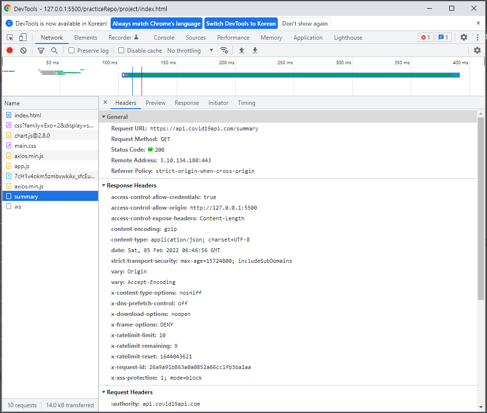
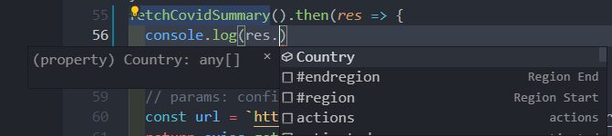
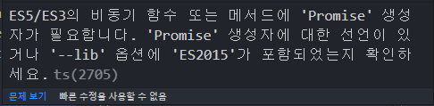

# 최종 프로젝트 - 프로젝트 구성 및 타입 시스템 적용

## 최종 프로젝트 진행 방향 설명

### 


## 점진적인 타입 시스템 적용 방법 - JSDoc

```javascript
// @ts-check
```

javascript에서 typescript효과가 나게 해줌.

타입스크립트의 가장 큰 장점 중 하나가 api쪽 인터페이스 정의에 있다.


```typescript
/**
* @returns {Promise}
*/
function fetchCovidSummary() {
  const url = 'https://api.covid19api.com/summary';
  return axios.get(url);
}
```

@returns를 통해 return의 타입을 정의 할 수 있다.

Ctrl + D를 이용해 사용하는 곳을 볼 수 있다.

url을 통해 get요청을 보낼 것이고, 해당 메소드를 사용한 곳을 보면 여전히 Promise에 any로 선언되있다.


response타입을 정의해보자.

개발자도구 Network탭에서 넘어온 데이터를 확인해보자.



아래처럼 데이터가 넘어온걸 preview에서 확인할 수 있다.

```json
{
    "ID": "6029e3f4-2c61-4b49-b38d-f169bdc77f86",
    "Message": "",
    "Global": {
        "NewConfirmed": 2717653,
        "TotalConfirmed": 388277801,
        "NewDeaths": 11083,
        "TotalDeaths": 5711177,
        "NewRecovered": 0,
        "TotalRecovered": 0,
        "Date": "2022-02-05T05:14:01.439Z"
    },
    "Countries": [
        {
            "ID": "1a00361a-14cc-46a8-9bac-35c77e7553c6",
            "Country": "Afghanistan",
            "CountryCode": "AF",
            "Slug": "afghanistan",
            "NewConfirmed": 631,
            "TotalConfirmed": 165358,
            "NewDeaths": 0,
            "TotalDeaths": 7420,
            "NewRecovered": 0,
            "TotalRecovered": 0,
            "Date": "2022-02-05T05:14:01.439Z",
            "Premium": {}
        },
       ...
    ],
    "Date": "2022-02-05T05:14:01.439Z"
}
```


```javascript
/**
 * @typedef {object} CovidSummary
 * @property {Array<object>} Country
 */
```

type별칭처럼 타입을 정의한다.

이처럼 타입과 속성을 정의하고 나서 호출해보자.

```javascript
fetchCovidSummary().then(res => { 
  console.log(res.)
})
```

이제 res에서 추천으로 Country가 뜨는것을 볼 수 있다.




## 타입스크립트 프로젝트 구성 및 기본 설정 추가

```shell
npm init -y
```

위 명령어로 package.json이 만들어지면서 기본 내용이 설정됨.


```shell
npm i typescript --save-dev
```

위 명령어로 typescript 설치


tsconfig.json파일을 생성해 기본 설정파일을 작성하자.

```json
{
  "compilerOptions": {
    "allowJs": true,
    "target": "ES5", 
    "outDir": "./built",
    "moduleResolution": "Node",
  },
  "include": ["./src/**/*"],
}
```

* allowJS : js파일을 ts에서 인식해서 그대로 쓰겠다는 속성
* target : tsc로 타입스크립트 파일을 js로 변경할때 기준 문법 버전
* outDir : 타입스크립트 결과물이 어디에 들어갈 건지.
* moduleResolution : Promise를 인식시켜주기 위해 node옵션을 추가
* include : project폴더를 기준으로 어떤 폴더를 대상으로 ts를 컴파일시킬 건지 -> 전부다 할건지 일부만할건지,<br/>include Default : ["`**/*`"]<br/>exclude Default  : [“node_modules”, “bower_components”, “jspm_packages”]


app.js -> ts로 변경하고, package.json을 수정하자.

scripts에 추가.

```json
"scripts": {
    "test": "echo \"Error: no test specified\" && exit 1",
    "build": "tsc"
  },
```

`npm run build`를 하게 되면, tsc를 한 것과 동일하다는 뜻.


npm run build를 하게 되면, 에러가 발생할 것이다. -> ts가 이해 못하는 타입 에러들이 있기 때문.

이 부분을 이제 수정해 나갈 것이다.


### NPM 참고

[NPM 소개 문서](https://joshua1988.github.io/webpack-guide/build/node-npm.html)

[NPM 커스텀 명령어 문서][https://joshua1988.github.io/webpack-guide/build/npm-custom-commands.html]

[NPM 무료 강의][https://www.inflearn.com/course/프런트엔드-웹팩/lecture/37370?tab=curriculum]


## 빌드 결과물 확인 및 타입스크립트 컴파일 동작 특징 설명

built폴더안에 app.js가 생긴것을 볼 수 있다.

build시에 error가 났음에도 built폴더에 app.js가 생겼다.

에러들을 살펴보면 Cannot find name ~~ , 등으로 해당 파일이 어딧는지 TS가 모른다는 타입에러이다.

그 이유는 index.html에 CDN형식으로 이미 서버에 배포해 놓은 파일을 가져와서 주입하고, app.js에서 다루고 있기 때문에 js입장에서는 ts로 바꿧을때 라이브러리들을 인식할 수 없다고 하는 것이다.<br/>=> TS가 인식할 수 있게 모듈화를 시켜주어야함.


## 타입스크립트 에러 디버깅 방법과 TS 컴파일 옵션 추가 설정

현재 tsconfig.json파일에 빨간줄을 살펴 보면 Promise를 찾을 수 없다고 뜬다.

그리고 app.ts파일에서 setupData메소드를 가서 error가 떠있는 걸 볼 수 있다.

에러에 대해 검색할 때 



사진의 **`ts(2705)`** 에러코드를 검색하거나 **에러 메세지를 검색**해도 된다.

위 문제를 검색해보고, 해결해보자.

lib추가.

```typescript
{
  "compilerOptions": {
    "allowJs": true,
    "target": "ES5", 
    "outDir": "./built",
    "moduleResolution": "Node",
    "lib":["ES2015", "DOM", "DOM.Iterable"]
  },
  "include": ["./src/**/*"],
}
```

