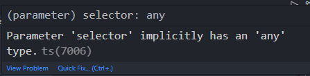
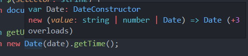
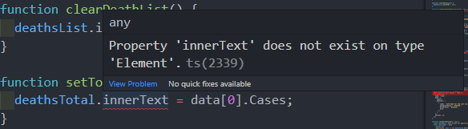
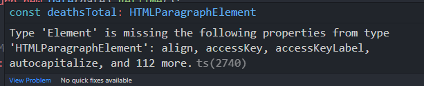

# 최종 프로젝트 - 점진적인 타입 적용

## 자바스크립트 프로젝트에 타입스크립트를 적용 하는 순서

기존에 build시스템이 구축되있는 상태에서 ts를 적용하기엔 더욱 복잡해진다.

아예 새로 만들어서 하나씩 적용하는 방법을 추천.


### 적용 순서

[JS에 TS 적용 순서](https://joshua1988.github.io/ts/etc/convert-js-to-ts.html#자바스크립트-프로젝트에-타입스크립트-적용하는-절차)

1. **타입스크립트 프로젝트 환경 구성**

2. **엄격하지 않은 타입 환경(loose type)에서 프로젝트 돌려보기**

3. **명시적인 any 선언하기**

4. **strict모드 설정하기**


## 명시적인 any 선언하기

`noImplicityAny: true`를 설정파일(tsconfig.json)에 추가.

```json
{
  "compilerOptions": {
    "allowJs": true,
    "target": "ES5", 
    "outDir": "./built",
    "moduleResolution": "Node",
    "lib":["ES2015", "DOM", "DOM.Iterable"],
    "noImplicitAny": true,
  },
  "include": ["./src/**/*"],
}
```

다시 build해보면 40개 에러가 생긴 것을 볼 수 있다.


## 함수 파라미터에 any타입 정의하기

noImplicityAny를 true로 설정하고나서 나타난 에러를 살펴보자.



타입설정을 하지 않은 곳에 any가 들어가서 발생한 에러다.

파라미터에 모두 : any를 작성하자.

! 바로 string으로 명시적으로 작성해도되지만 처음 해보는 작업이기 때문에 모두 any로 먼저 작성.

```typescript
// @ts-check

// utils
function $(selector: any) {
  return document.querySelector(selector);
}
function getUnixTimestamp(date: any) {
  return new Date(date).getTime();
}

// DOM
const confirmedTotal = $('.confirmed-total');
const deathsTotal = $('.deaths');
const recoveredTotal = $('.recovered');
const lastUpdatedTime = $('.last-updated-time');
const rankList = $('.rank-list');
const deathsList = $('.deaths-list');
const recoveredList = $('.recovered-list');
const deathSpinner = createSpinnerElement('deaths-spinner');
const recoveredSpinner = createSpinnerElement('recovered-spinner');

function createSpinnerElement(id: any) {
  const wrapperDiv = document.createElement('div');
  wrapperDiv.setAttribute('id', id);
  wrapperDiv.setAttribute(
    'class',
    'spinner-wrapper flex justify-center align-center',
  );
  const spinnerDiv = document.createElement('div');
  spinnerDiv.setAttribute('class', 'ripple-spinner');
  spinnerDiv.appendChild(document.createElement('div'));
  spinnerDiv.appendChild(document.createElement('div'));
  wrapperDiv.appendChild(spinnerDiv);
  return wrapperDiv;
}

// state
let isDeathLoading = false;
let isRecoveredLoading = false;


function fetchCovidSummary() {
  const url = 'https://api.covid19api.com/summary';
  return axios.get(url);
}

function fetchCountryInfo(countryCode: any, status: any) {
  // params: confirmed, recovered, deaths
  const url = `https://api.covid19api.com/country/${countryCode}/status/${status}`;
  return axios.get(url);
}

// methods
function startApp() {
  setupData();
  initEvents();
}

// events
function initEvents() {
  rankList.addEventListener('click', handleListClick);
}

async function handleListClick(event: any) {
  let selectedId;
  if (
    event.target instanceof HTMLParagraphElement ||
    event.target instanceof HTMLSpanElement
  ) {
    selectedId = event.target.parentElement.id;
  }
  if (event.target instanceof HTMLLIElement) {
    selectedId = event.target.id;
  }
  if (isDeathLoading) {
    return;
  }
  clearDeathList();
  clearRecoveredList();
  startLoadingAnimation();
  isDeathLoading = true;
  const { data: deathResponse } = await fetchCountryInfo(selectedId, 'deaths');
  const { data: recoveredResponse } = await fetchCountryInfo(
    selectedId,
    'recovered',
  );
  const { data: confirmedResponse } = await fetchCountryInfo(
    selectedId,
    'confirmed',
  );
  endLoadingAnimation();
  setDeathsList(deathResponse);
  setTotalDeathsByCountry(deathResponse);
  setRecoveredList(recoveredResponse);
  setTotalRecoveredByCountry(recoveredResponse);
  setChartData(confirmedResponse);
  isDeathLoading = false;
}

function setDeathsList(data: any) {
  const sorted = data.sort(
    (a: any, b: any) => getUnixTimestamp(b.Date) - getUnixTimestamp(a.Date),
  );
  sorted.forEach((value: any) => {
    const li = document.createElement('li');
    li.setAttribute('class', 'list-item-b flex align-center');
    const span = document.createElement('span');
    span.textContent = value.Cases;
    span.setAttribute('class', 'deaths');
    const p = document.createElement('p');
    p.textContent = new Date(value.Date).toLocaleDateString().slice(0, -1);
    li.appendChild(span);
    li.appendChild(p);
    deathsList.appendChild(li);
  });
}

function clearDeathList() {
  deathsList.innerHTML = null;
}

function setTotalDeathsByCountry(data: any) {
  deathsTotal.innerText = data[0].Cases;
}

function setRecoveredList(data: any) {
  const sorted = data.sort(
    (a: any, b: any) => getUnixTimestamp(b.Date) - getUnixTimestamp(a.Date),
  );
  sorted.forEach((value: any) => {
    const li = document.createElement('li');
    li.setAttribute('class', 'list-item-b flex align-center');
    const span = document.createElement('span');
    span.textContent = value.Cases;
    span.setAttribute('class', 'recovered');
    const p = document.createElement('p');
    p.textContent = new Date(value.Date).toLocaleDateString().slice(0, -1);
    li.appendChild(span);
    li.appendChild(p);
    recoveredList.appendChild(li);
  });
}

function clearRecoveredList() {
  recoveredList.innerHTML = null;
}

function setTotalRecoveredByCountry(data: any) {
  recoveredTotal.innerText = data[0].Cases;
}

function startLoadingAnimation() {
  deathsList.appendChild(deathSpinner);
  recoveredList.appendChild(recoveredSpinner);
}

function endLoadingAnimation() {
  deathsList.removeChild(deathSpinner);
  recoveredList.removeChild(recoveredSpinner);
}

async function setupData() {
  const { data } = await fetchCovidSummary();
  setTotalConfirmedNumber(data);
  setTotalDeathsByWorld(data);
  setTotalRecoveredByWorld(data);
  setCountryRanksByConfirmedCases(data);
  setLastUpdatedTimestamp(data);
}

function renderChart(data: any, labels: any) {
  var ctx = $('#lineChart').getContext('2d');
  Chart.defaults.color = '#f5eaea';
  Chart.defaults.font.family = 'Exo 2';
  new Chart(ctx, {
    type: 'line',
    data: {
      labels,
      datasets: [
        {
          label: 'Confirmed for the last two weeks',
          backgroundColor: '#feb72b',
          borderColor: '#feb72b',
          data,
        },
      ],
    },
    options: {},
  });
}

function setChartData(data: any) {
  const chartData = data.slice(-14).map((value: any) => value.Cases);
  const chartLabel = data
    .slice(-14)
    .map((value: any) => new Date(value.Date).toLocaleDateString().slice(5, -1));
  renderChart(chartData, chartLabel);
}

function setTotalConfirmedNumber(data: any) {
  confirmedTotal.innerText = data.Countries.reduce(
    (total: any, current: any) => (total += current.TotalConfirmed),
    0,
  );
}

function setTotalDeathsByWorld(data: any) {
  deathsTotal.innerText = data.Countries.reduce(
    (total: any, current: any) => (total += current.TotalDeaths),
    0,
  );
}

function setTotalRecoveredByWorld(data: any) {
  recoveredTotal.innerText = data.Countries.reduce(
    (total: any, current: any) => (total += current.TotalRecovered),
    0,
  );
}

function setCountryRanksByConfirmedCases(data: any) {
  const sorted = data.Countries.sort(
    (a: any, b: any) => b.TotalConfirmed - a.TotalConfirmed,
  );
  sorted.forEach((value: any) => {
    const li = document.createElement('li');
    li.setAttribute('class', 'list-item flex align-center');
    li.setAttribute('id', value.Slug);
    const span = document.createElement('span');
    span.textContent = value.TotalConfirmed;
    span.setAttribute('class', 'cases');
    const p = document.createElement('p');
    p.setAttribute('class', 'country');
    p.textContent = value.Country;
    li.appendChild(span);
    li.appendChild(p);
    rankList.appendChild(li);
  });
}

function setLastUpdatedTimestamp(data: any) {
  lastUpdatedTime.innerText = new Date(data.Date).toLocaleString();
}

startApp();

```

다시 build하게되면, error가 5개로 줄어든 것을 볼 수 있다.


## 화살표 함수 소개 및 타입 정의하기

[화살표 함수 문법 소개 글](https://joshua1988.github.io/vue-camp/es6+/fat-arrow.html)

[화살표 함수 MDN 문서](https://developer.mozilla.org/en-US/docs/Web/JavaScript/Reference/Functions/Arrow_functions)


기존에 함수 선언하는 방법에 **함수 선언문과 함수 표현식**이 있다.

```javascript
// ES5- 함수 선언문
function sum(a, b) { 
  return a + b;
}

// ES5- 함수 표현식
var sum = function (a, b) { 
  return a + b;
}
```

이 함수 표현식을 ES6부터 화살표를 이용해 변경할 수 있다.

```javascript
// ES6+ - 함수 표현식
var sum = (a, b) => { 
  return a + b;
}

var sum = (a, b) => a + b;
```


타입스크립트에서 화살표함수

```typescript
var sum = (a:number, b:number):number => { 
  return a + b;
}
```


## 화살표 any 함수에 타입 추가하기

setDeathsList 메소드를 살펴보자.

```typescript
function setDeathsList(data: any) {
  const sorted = data.sort(
    (a: any, b: any) => getUnixTimestamp(b.Date) - getUnixTimestamp(a.Date),
  );
  sorted.forEach(value => {
    const li = document.createElement('li');
    li.setAttribute('class', 'list-item-b flex align-center');
    const span = document.createElement('span');
    span.textContent = value.Cases;
    span.setAttribute('class', 'deaths');
    const p = document.createElement('p');
    p.textContent = new Date(value.Date).toLocaleDateString().slice(0, -1);
    li.appendChild(span);
    li.appendChild(p);
    deathsList.appendChild(li);
  });
}
```

forEach부분의 value에서가 고민됐을 수 있는데, 화살표함수를 사용하면서 ()를 벗겨낸 경우다.

value를 ()로 감싸고 타입을 선언해주면 해결이 된다.


## DOM 관련 타입 구체화

DOM관련된 타입에 대해서 정의.

### Util 함수들

가장 먼저 나오는 util함수부터 살펴보자.

### $()

**$들**은 작성한 클래스 이름의 dom정보를 가져오기 위한 메소드 이다.

```typescript
function $(selector: any) {
  return document.querySelector(selector);
}
// DOM
const confirmedTotal = $('.confirmed-total');
const deathsTotal = $('.deaths');
const recoveredTotal = $('.recovered');
const lastUpdatedTime = $('.last-updated-time');
const rankList = $('.rank-list');
const deathsList = $('.deaths-list');
const recoveredList = $('.recovered-list');
```

selector로 넘어오는 값이 css 선택자 값으로 문자열이 넘어오니 any를 string으로 바꿀 수 있다.


### getUnixTimestamp

그 다음 **getUnixTimestamp**은 시간을 가져오는 메소드다.

```typescript
function getUnixTimestamp(date: string | number | Date) {
  return new Date(date).getTime();
}
```

일단 파라미터가 string이면 정상 동작된다.

return 값의 new Date를 살펴보면,



string, number 또 Date도 될 수 있는 것을 볼 수 있다.

파라미터로 가져와 쓸 때 이미 자바스크립트 안의 내장 객체나 api라면 타입이 추론이 된다.

```typescript
function getUnixTimestamp(date: string | number | Date) { ... }
```

이처럼 모두 써 줄 수도 있다.

함수의 반환 값 경우 strict모드에 대해 살펴볼 때 같이 볼 예정.


### createSpinnerElement

createSpinnerElement의 경우 넘겨 받은 id로 id속성 값을 넣는 것이기 때문에 문자열로 바꿔 줄 수 있다.

```typescript
function createSpinnerElement(id: string) {
  const wrapperDiv = document.createElement('div');
  wrapperDiv.setAttribute('id', id);
	 ...
  return wrapperDiv;
}
```


## API 함수 타입 구체화

API함수들에 대해 살펴 보자.

return되는 값을 보고, 타입을 정의 해주어야하는데 일단은 파라미터에 대한 것들만 설정해보자.

( 외부 라이브러리 모듈화를 진행할 때 진행할 예정. )

DOCUMENT를 보고,  파라미터를 지정하자.

**DOCUMENT**<br/>[COVID19 API DOCUMENT](https://documenter.getpostman.com/view/10808728/SzS8rjbc?version=latest#63fda84a-6b43-4506-9cc7-2172561d5c16)<br/>Live By Country And Status를 보면 된다.

### fetchCovidSummary

국가별 코로나 정보를 요약해 받아오는 메소드


### fetchCountryInfo

특정 국가의 코로나 정보를 받아오는 메소드

* countryCode : 대문자 두글자로 구성된 문자열로 구성 되있다.

* status : confirmed, required, deaths 3가지로만 구성.

status가 3가지로 정해진 값만 오니까 enum으로 선언해 볼 수 있다.

```typescript
enum CovidStatus { 
  Confirmed = 'confirmed',
  Recovered = 'recovered',
  Deaths = 'deaths',
}
function fetchCountryInfo(countryCode: string, status: CovidStatus) { ... }
```

CovidStatus.Confirmed | Recoverd등을 하게 되면, 각각 해당하는 문자열이 파라미터로 들어간다.

반환값은 추후에 외부라이브러리 모듈화를 진행할때 같이 진행할 예정.


## API 함수 타입 정의에 따른 타입 오류 해결

위에서 함수 타입에 대한 정의를 통해 추가적인 sideEffect가 생겼을 것이다.

하나씩 고쳐보자.

88번째 줄(작성기준)에서 deaths 문자열을 그대로 넘기다가, 타입 정의 이후 에러가 발생했다.

```typescript
const { data: deathResponse } = await fetchCountryInfo(selectedId, 'deaths');
```

fetchCountryInfo에 마우스를 올려보면, status의 타입이 이제 CovidStatus인걸 볼 수 있다.


```typescript
const { data: deathResponse } = await fetchCountryInfo(selectedId, CovidStatus.Deaths);
```

enum타입인 CovidStatus의 Deaths로 작성하여 고칠 수 있다.

아래 두가지(Recovered, Confirmed)도 똑같이 고칠 수 있다.


여기서 눈여겨 볼점!

**작성 시 나타나는 자동완성**

> **CovidStatus가 enum으로 되어있으니 넘길 수 있는 파라미터가 제약되어 있고, 그 값들이 어떤게 있다는 것을 자동완성을 통해 알 수 있다!**


## DOM 함수 관련 타입 오류 분석

128번째 줄 setTotalDeathsByCountry를 보면 innerText에서 에러가 발생했다.

```typescript
function setTotalDeathsByCountry(data: any) {
  deathsTotal.innerText = data[0].Cases;
}
```



`innerText는 현재 Element타입이 없다`는 메세지 이다.

DeathTotal을 먼저 살펴보자.

deaths라는 클래스이름으로 접근한 Element이다.

```html
<p class="total deaths">0</p>
```


Element를 쫒아가보자. (Element를 치고 Ctrl+클릭)

```typescript
Element is the most general base class from which all objects in a Document inherit. It only has methods and properties common to all kinds of elements. More specific classes inherit from Element.

Element는 Document의 모든 객체가 상속하는 가장 일반적인 기본 클래스입니다. 
모든 종류의 요소에 공통적인 메서드와 속성만 있습니다. 보다 구체적인 클래스는 Element에서 상속됩니다.
```


```typescript
var a: Element | HTMLElement | HTMLParagraphElement
```

Element가 있고, 그 하위에 상속을 받아 확장한 것이 HTMLElement.

그 HTMLElement를 상속받아 더 자세히 확장한것이 HTMLParagraphElement다.


에러를 해결하기위해 deaths에 더 구체적인 타입인 HTMLParagraphElement를 정의하자.

deaths가 HTMLParagraphElement로 정의하게되면 Element가 HTMLParagraphElement와 1대1로 호환이 될 수 없다는 호환 관련 에러가 발생한다.<br/>(Element에 HTMLParagraphElement에 없는 것들이 있기 때문에 맞지 않다는 에러.)




## DOM 함수 타입 오류 해결하기

위의 에러에 대해서 다시 살펴보자.

위에서 HTMLParagraphElement는 HTMLElement를, HTMLElement는 Element를 확장해 나간 것이라고 하였다.(vsCode에서 해당 단어를 치고 Ctrl+클릭으로 볼 수 있음.)

이런것들이 점점 확장되면서 추가적으로 구체화되었다. 그래서 추가로 작성한 것이 Element에 없다고 에러가 뜬것이다.


해결하려면?

deathsTotal에 대한 타입선언이 아닌 넘어오는 결과에 대한 **타입단언**이 필요하다.

```typesc
const deathsTotal = $('.deaths') as HTMLParagraphElement;
```


기존의 코드를 다시 살펴보자.

```typescript
function $(selector: string) {
  return document.querySelector(selector);
}

const deathsTotal = $('.deaths');
```

$()의 결과값의 타입을 따로 선언해주지 않았기 때문에 **querySelector의 결과타입이 그대로 같이  추론**되어서 **Element**가 된다.

그래서 넘어오는 값이 구체적으로 HTMLParagraphElement라고 선언해주면 된다.


confirmedTotal, recoveredTotal, lastUpdatedTime도 각 태그에 맞게 세부타입으로 타입단언을 해주면 된다.

confirmedTotal - HTMLSpanElement

recoveredTotal, deathsTotal, lastUpdatedTime - HTMLParagraphElement

이런 타입단언 뿐만 아니라 반복되면 제네릭을 이용해 util메소드로 만들 수도 있다. 참고!