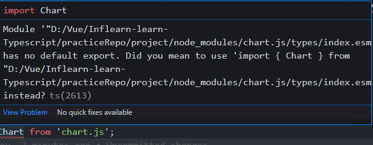
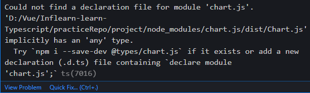
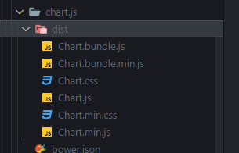

# 최종 프로젝트 - 외부 라이브러리 모듈화

## 외부 라이브러리 모듈화 진행을 위한 사전 작업

프로젝트 내부 README.md 수정.

## 프로젝트의 라이브러리 로딩방식 확인 및 모듈화 방법 안내

현재 axios와 Chart.js가 에러나는 것을 볼 수 있다.

index.html을 보면 library를 들고 온 것을 볼 수 있다.

```typescript
// 라이브러리 로딩
import 변수명 from '라이브러리 이름'
// 변수 함수 임포트 문법
import {} from `파일 상대 경로`;
```


## Axios 라이브러리 설치 및 타입 에러 확인

[Axios Github](https://github.com/axios/axios)

```shell
npm i axios
```

이렇게 설치하면 devDependencies가 아니라 그냥 dependencies에 들어 가는 것을 확인할 수 있다.

```json
 "devDependencies": {
    "@babel/core": "^7.17.0",
    "@babel/preset-env": "^7.16.11",
    "@babel/preset-typescript": "^7.16.7",
    "@typescript-eslint/eslint-plugin": "^5.10.2",
    "@typescript-eslint/parser": "^5.10.2",
    "eslint": "^8.8.0",
    "eslint-plugin-prettier": "^4.0.0",
    "prettier": "^2.5.1",
    "typescript": "^4.5.5"
  },
  "dependencies": {
    "axios": "^0.25.0"
  }
```

이제 app.ts에서 axios를 임포트하자.

```typescript
import axios from 'axios';
```

이제 기존의 axios부분이 에러가 해결되었다.


## Chart.js 라이브러리 설치 및 타입 에러 확인

[Chart.js  공식문서](https://www.chartjs.org/)

```shell
npm install chart.js --save
```

axios와 동일하게 설치하면 dependencies로 설치 된걸 볼 수 있다.

```json
"dependencies": {
    "axios": "^0.25.0",
    "chart.js": "^3.7.0"
  }
```


```typescript
import Chart from 'chart.js'
```

 임포트하면 에러가 날 것이다.



(영상에서는 ts(7016)이지만 나는 현재 2613으로 남.)

## 라이브러리 임포트 구문에서 나는 타입 에러 분석

[타입스크립트의 모듈 해석방식](https://www.typescriptlang.org/docs/handbook/module-resolution.html)

axios파일 내부로 들어가보자. 

nodemodules에 설치를 하면, 그 안의 `indx.d.ts`파일을 참고한다.

처음 axios를 만들 때는 기본적으로 Javascript로 만들어지고, 중간에 Typescript로 만들어 졌는데 이때 타입스크립트가 인식할 수 있도록 타입 정의를 해주어야한다.

=> 그게 바로 index.d.ts파일.


chart.js로 가보면, Typescript파일이 없다.

(현재는 있는듯 함. 그래서 다른 에러가 발생.)

그래서 chart.js의 버전을 낮추어서 테스트 해보았다.



영상과 동일한 에러가 나타남.



뭔가 ts에 대한내용이 없다.

버전업상태에서 진행해도 되지만, 버전을 맞춰서 진행해볼 예정

(이제 다음 영상으로 진행)


## Chart.js라이브러리 설치 후 에러 해결

에러에서 @types/chart.js를 설치하라는 내용이 있다.

npm에서 살펴보면, 별도로 @types/chart.js를 설치할 수 있는걸 볼 수 있다.

```shell
npm install --save @types/chart.js
```

설치후 따라가보면 타입정의가 된 것을 볼 수 있다.


## Chart.js 라이브러리 임포트 문법 오류 해결

현재 chart.js를 불러오는 Chart에서 에러가 발생하고 있다.

이는 모듈 방식 자체의 문제.

```typescript
import * as Chart from 'chart.js'
```

로 수정.

참고

[Import * as Chart from 'chart.js'로 해야하는 이유](https://stackoverflow.com/questions/56238356/understanding-esmoduleinterop-in-tsconfig-file)


나는 에러메세지를 검색해서 찾아보았다.

[에러 관련 검색 01](https://stackoverflow.com/questions/62273153/this-module-is-declared-with-using-export-and-can-only-be-used-with-a-defau)

[에러 관련 검색 02](https://pewww.tistory.com/26)

위 문제는  CommonJS 모듈을 ES6 모듈 코드베이스로 가져오려고 할 때 문제가 발생.

```text
// 1
require(~~~);

// 2
import * as ~~~
```

영상내용처럼 이렇게 해결할 수 있지만, moment의 경우  **\* 를 사용하여 import 하려는 대상의 타입이 Object가 아닌 경우에는 ES6의 모듈 사양에 호환되지 않게 됩니다.**

그래서 아래의 속성을 추가하는 것으로 해결할 수 있습니다.

추가속성 :  `"esModuleInterop": true`

```json
{
  "compilerOptions": {
    "allowJs": true,
    "checkJs": true,
    "noImplicitAny": true,
    "esModuleInterop": true
  },
  "include": ["./src/**/*"]
}
```

! VSCode를 껏다가 다시 실행시켜야 적용될 수도 있다.


## Definitely Typed 소개

[Definitely Typed Github Repo](https://github.com/DefinitelyTyped/DefinitelyTyped)

Definitely Typed는 Typescript 타입 정의를 위해 고퀄리티의 타입정의들을 모아놓은 것.

js라이브러리를 타입스크립트에서 인식하게하려면 타입정의를 해주어야하는데 개발자가 일일이 정의하게되면 비용이 많이 들기 때문에 잘 정의된 형태로 오픈소스화 해놓은것.


[타입 정의가 제공되는 오픈소스 라이브러리 검색 사이트](https://www.typescriptlang.org/dt/search?search=)

여기서 설치하려는 라이브러리를 검색하여 타입 정의가 되는지 안되는지 검색할 수 있는 사이트.

여기서 chart.js를 검색해보면 @types/chart.js가 --save-dev로 되있는 것을 볼 수 있다.

타입스크립트가 이해할 수 있게 보조하는 보조역할이기 때문에 devDependencies로 설치.


## 타입 선언 라이브러리가 제공되지 않는 외부라이브러리 대처 방법

```json
"typeRoots": ["./node_modules/@types"],
```

nodemodules에 @types파일들을 돌면서 타입정의파일을 들고옴.

만약 직접 타입 지정을 해야된다하면, 추가로 경로를 지정해줄 수 있다.

```json
"typeRoots": ["./node_modules/@types", "types"],
```


프로젝트 폴더에서 types폴더를 만들고 그안에 chart.js폴더를 만들어 index.d.ts파일을 생성 후 아래처럼 작성

```typescript
// index.d.ts
declare module 'chart.js';
```
