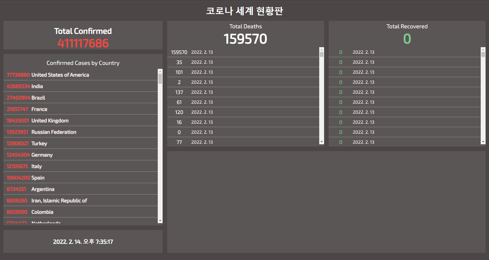
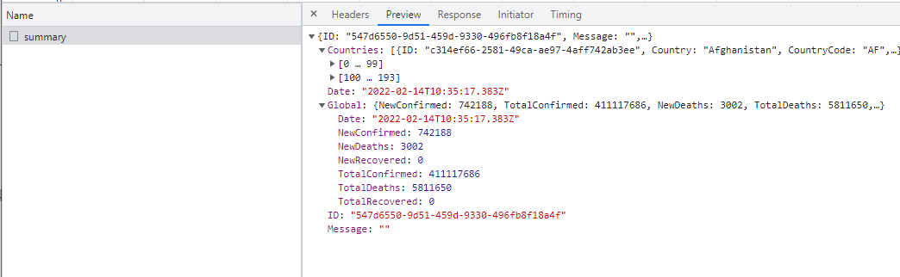
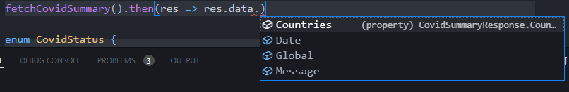
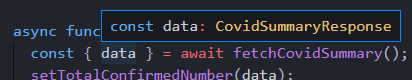

# 최종 프로젝트 - API 함수 타입 정의

## API 함수 타입 정의 안내

### fetchCovidSummary()

```typescript
function fetchCovidSummary() {
  const url = 'https://api.covid19api.com/summary';
  return axios.get(url);
}
```

현재 해당 메소드를 사용하는 곳을 가보면, 타입이 any로 되어있다.

index.html에서 live server를 실행시켜보자.(app.js위치에 built폴더 추가.)




## 전세계 코로나 요약 정보 API 함수 반환 타입 정의

반환타입은 axios.get()의 반환 결과가 될 것이다.

타입 추론에 의해 fetchCovidSummary에 마우스를 올려보면 `Promise<AxiosResponse<any>>`가 추론되는 걸 볼 수 있다.

우리가 정할 것은 any에 들어갈 타입이다.

개발자 도구에서 fetchSummary가 어떻게 넘어 가는지 보자.




```json
// data의 형태
Countries: [{ID: "c314ef66-2581-49ca-ae97-4aff742ab3ee", Country: "Afghanistan", CountryCode: "AF",…},…]
    [0 … 99]
    [100 … 193]
Date: "2022-02-14T10:35:17.383Z"
Global: {NewConfirmed: 742188, TotalConfirmed: 411117686, NewDeaths: 3002, TotalDeaths: 5811650,…}
  Date: "2022-02-14T10:35:17.383Z"
  NewConfirmed: 742188
  NewDeaths: 3002
  NewRecovered: 0
  TotalConfirmed: 411117686
  TotalDeaths: 5811650
  TotalRecovered: 0
  ID: "547d6550-9d51-459d-9330-496fb8f18a4f"
Message: ""
```


interface를 만들어 타입정의해보자.

```typescript
interface CovidSummaryResponse{
  Countries: any[];
  Date: string;
  Global: any;
  Message: string;
}
```

```typescript
function fetchCovidSummary(): Promise<AxiosResponse<CovidSummaryResponse>> {
  const url = 'https://api.covid19api.com/summary';
  return axios.get(url);
}
```

선언해주고 나면, 타입추론이 되는 것을 볼 수있다.




## 전세계 코로나 요약 정보 API 함수 반환 타입 모듈화 및 구체화

타입을 위로 바로쓰게되면 타입정의 하는 코드가 더 많아질 것이다.

타입정의 코드와 로직 코드를 구분해보자.

covid폴더를 만들어 타입정의를 해놓을 파일 index.ts를 만들고 아까 작성한 인터페이스를 그대로 옮기자.

```typescript
// index.ts
export interface CovidSummaryResponse {
  Countries: any[];
  Date: string;
  Global: any;
  Message: string;
}
```

넘어온 데이터를 토대로 인터페이스를 만들어 타입정의를 해보자.

```typescript
// 타입들을 모아놓은 파일.
interface Country {
  Country: string;
  CountryCode: string;
  Date: string;
  NewConfirmed: number;
  NewDeaths: number;
  Premium: any;
  Slug: string;
  TotalConfirmed: number;
  TotalDeaths: number;
  TotalRecovered: number;
}

interface Global {
  NewConfirmed: number;
  NewDeaths: number;
  NewRecovered: number;
  TotalConfirmed: number;
  TotalDeaths: number;
  TotalRecovered: number;
}

export interface CovidSummaryResponse {
  Countries: Country[];
  Date: string;
  Global: Global;
  Message: string;
}
```


##  [실습 안내]국가별 코로나 정보 API 함수 타입 정의 방법

fetchCountryInfo에 타입을 추가할 건데 먼저 initEvents를 살펴보자.

목록에서 아무거나 클릭해보면 호출된 것을 볼 수 있다.

이것을 보고 api의 반환타입들을 정의하는 실습을 진행해보자.


## [실습 풀이] 국가별 코로나 정보 API 함수 타입 정의

데이터가 바로 배열이기 때문에 타입으로 정의

```tpyescript
interface CountrySummaryInfo {
  Cases: number;
  City: string;
  Country: string;
  CityCode: string;
  CountryCode: string;
  Date: string;
  Lat: string;
  Lon: string;
  Province: string;
  Status: string;
}

type CountrySummaryResponse = CountrySummaryInfo[];
```


## 전세계 코로나 요약 정보 API 함수 관련 코드 타입 정의

```typescript
async function setupData() {
  const { data } = await fetchCovidSummary();
  setTotalConfirmedNumber(data);
  setTotalDeathsByWorld(data);
  setTotalRecoveredByWorld(data);
  setCountryRanksByConfirmedCases(data);
  setLastUpdatedTimestamp(data);
}
```

setupData에서 data마우스를 올리면, fetchCovidSummary의 타입을 선언해주었기 때문에 타입 추론이 되는 것을 볼 수 있다.




setupData의 함수들을 살펴보자.

```typescript
function setTotalConfirmedNumber(data: any) {
  confirmedTotal.innerText = data.Countries.reduce(
    (total: any, current: any) => (total += current.TotalConfirmed),
    0
  );
}
```

any로 선언한 부분을 이제 수정해 줄 수 있다.

```typescript
function setTotalConfirmedNumber(data: any) {
  confirmedTotal.innerText = data.Countries.reduce(
    (total: any, current: any) => (total += current.TotalConfirmed),
    0
  );
}
```


## reduce API

[reduce API - MDN](https://developer.mozilla.org/ko/docs/Web/JavaScript/Reference/Global_Objects/Array/Reduce)

배열을 순회하면서 연산을 하여 하나의 값을 뽑아 내는 메소드.


##  특정 국가의 총 확진자 수 계산 함수 타입 정의

```typescript
function setTotalConfirmedNumber(data: any) {
  confirmedTotal.innerText = data.Countries.reduce(
    (total: any, current: any) => (total += current.TotalConfirmed),
    0
  );
}
```

total이 callback, current가 요소.


reduce에 마우스를 올려보면, currentValue가 Country로 자동 추론되는 것을 볼 수 있다.

=> current를 Country로 선언.

=> 자동 import 되고 에러가나면 타입 선언한 곳에서 export를 해주어야함.


total은 숫자를 계속 더하면 number이 될 것이기 때문에 number로 선언

그러면 innerText에 에러가 발생할 것이다.

=> innerText는 string타입이지만, 도출된 값은 number이기 때문.

=> 끝에 toString을 사용하여 문자열로 변경해주자.

```typescript
function setTotalConfirmedNumber(data: CovidSummaryResponse) {
  confirmedTotal.innerText = data.Countries.reduce(
    (total: number, current: Country) => (total += current.TotalConfirmed),
    0
  ).toString();
}
```


## 전세계 코로나 요약 정보 API 함수 관련 나머지 타입 정의

이번 강의를 시작하기 전 setTotalConfirmedNumber처럼 타입추론된걸 보면서 setupData에 있던 나머지 메소드들의 타입정의를 미리 해보았다.

```typescript
function setTotalConfirmedNumber(data: CovidSummaryResponse) {
  confirmedTotal.innerText = data.Countries.reduce(
    (total: number, current: Country) => (total += current.TotalConfirmed),
    0
  ).toString();
}

function setTotalDeathsByWorld(data: CovidSummaryResponse) {
  deathsTotal.innerText = data.Countries.reduce(
    (total: number, current: Country) => (total += current.TotalDeaths),
    0
  ).toString();
}

function setTotalRecoveredByWorld(data: CovidSummaryResponse) {
  recoveredTotal.innerText = data.Countries.reduce(
    (total: number, current: Country) => (total += current.TotalRecovered),
    0
  ).toString();
}

function setCountryRanksByConfirmedCases(data: CovidSummaryResponse) {
  const sorted = data.Countries.sort(
    (a: Country, b: Country) => b.TotalConfirmed - a.TotalConfirmed
  );
  sorted.forEach((value: Country) => {
    const li = document.createElement('li');
    li.setAttribute('class', 'list-item flex align-center');
    li.setAttribute('id', value.Slug);
    const span = document.createElement('span');
    span.textContent = value.TotalConfirmed.toString();
    span.setAttribute('class', 'cases');
    const p = document.createElement('p');
    p.setAttribute('class', 'country');
    p.textContent = value.Country;
    li.appendChild(span);
    li.appendChild(p);
    rankList.appendChild(li);
  });
}

function setLastUpdatedTimestamp(data: CovidSummaryResponse) {
  lastUpdatedTime.innerText = new Date(data.Date).toLocaleString();
}
```


## [실습 안내] 특정 국가 코로나 정보 API함수 관련 타입 정의 실습 안내

any로 선언한 부분을 마저 작성해 나갈 것이다.

fetchCountryInfo와 관련된 메소드 - handleListClick를 살펴보자

```typescript
async function handleListClick(event: any) {
  let selectedId;
  if (
    event.target instanceof HTMLParagraphElement ||
    event.target instanceof HTMLSpanElement
  ) {
    selectedId = event.target.parentElement.id;
  }
  if (event.target instanceof HTMLLIElement) {
    selectedId = event.target.id;
  }
  if (isDeathLoading) {
    return;
  }
  clearDeathList();
  clearRecoveredList();
  startLoadingAnimation();
  isDeathLoading = true;
  const { data: deathResponse } = await fetchCountryInfo(
    selectedId,
    CovidStatus.Deaths
  );
  const { data: recoveredResponse } = await fetchCountryInfo(
    selectedId,
    CovidStatus.Recovered
  );
  const { data: confirmedResponse } = await fetchCountryInfo(
    selectedId,
    CovidStatus.Confirmed
  );
  endLoadingAnimation();
  setDeathsList(deathResponse);
  setTotalDeathsByCountry(deathResponse);
  setRecoveredList(recoveredResponse);
  setTotalRecoveredByCountry(recoveredResponse);
  setChartData(confirmedResponse);
  isDeathLoading = false;
}
```

handleListClick은 함수를 호출하자마자 initEvents()에서 추가하는 click이벤트이다.

clickEvent이기 때문에 들어오는 타입은 MouseEvent가 된다.

```typescript
async function handleListClick(event: MouseEvent) { ... }
```


```typescript
const { data: deathResponse } = await fetchCountryInfo(
     selectedId,
     CovidStatus.Deaths
 );
const { data: recoveredResponse } = await fetchCountryInfo(
    selectedId,
    CovidStatus.Recovered
);
const { data: confirmedResponse } = await fetchCountryInfo(
    selectedId,
    CovidStatus.Confirmed
);
```

여기서 추론되는 타입을 보면 CountrySummaryResponse인 것을 확인할 수 있다.

먼저 setDeathsList부터 보자.

```typescript
function setDeathsList(data: any) {
  const sorted = data.sort(
    (a: any, b: any) => getUnixTimestamp(b.Date) - getUnixTimestamp(a.Date)
  );
  sorted.forEach((value: any) => {
    const li = document.createElement('li');
    li.setAttribute('class', 'list-item-b flex align-center');
    const span = document.createElement('span');
    span.textContent = value.Cases;
    span.setAttribute('class', 'deaths');
    const p = document.createElement('p');
    p.textContent = new Date(value.Date).toLocaleDateString().slice(0, -1);
    li.appendChild(span);
    li.appendChild(p);
    deathsList.appendChild(li);
  });
}
```

들어오는 data는 CountrySummaryResponse이니 수정.

sort에서 추론되는 타입을 확인해보면 CountrySummaryInfo인 것을 볼 수 있다.<br/>=> export 시켜주어야함.

forEach에서도 CountrySummaryInfo

마지막으로 textContent의 값을 보면 number기 때문에 toString()을 시켜주면 완성

```typescript
function setDeathsList(data: CountrySummaryResponse) {
  const sorted = data.sort(
    (a: CountrySummaryInfo, b: CountrySummaryInfo) =>
      getUnixTimestamp(b.Date) - getUnixTimestamp(a.Date)
  );
  sorted.forEach((value: CountrySummaryInfo) => {
    const li = document.createElement('li');
    li.setAttribute('class', 'list-item-b flex align-center');
    const span = document.createElement('span');
    span.textContent = value.Cases.toString();
    span.setAttribute('class', 'deaths');
    const p = document.createElement('p');
    p.textContent = new Date(value.Date).toLocaleDateString().slice(0, -1);
    li.appendChild(span);
    li.appendChild(p);
    deathsList.appendChild(li);
  });
}
```


## 사전 실습

```typescript
setDeathsList(deathResponse);
setTotalDeathsByCountry(deathResponse);
setRecoveredList(recoveredResponse);
setTotalRecoveredByCountry(recoveredResponse);
setChartData(confirmedResponse);
```

위 메소드들에 대한 타입정의


### setDeathsList

```typescript
function setDeathsList(data: CountrySummaryResponse) {
  const sorted = data.sort(
    (a: CountrySummaryInfo, b: CountrySummaryInfo) =>
      getUnixTimestamp(b.Date) - getUnixTimestamp(a.Date)
  );
  sorted.forEach((value: CountrySummaryInfo) => {
    const li = document.createElement('li');
    li.setAttribute('class', 'list-item-b flex align-center');
    const span = document.createElement('span');
    span.textContent = value.Cases.toString();
    span.setAttribute('class', 'deaths');
    const p = document.createElement('p');
    p.textContent = new Date(value.Date).toLocaleDateString().slice(0, -1);
    li.appendChild(span);
    li.appendChild(p);
    deathsList.appendChild(li);
  });
}
```


### setTotalDeathsByCountry

```typescript
function setTotalDeathsByCountry(data: CountrySummaryResponse) {
  deathsTotal.innerText = data[0].Cases.toString();
}
```


### setRecoveredList

```typescript
function setRecoveredList(data: CountrySummaryResponse) {
  const sorted = data.sort(
    (a: CountrySummaryInfo, b: CountrySummaryInfo) =>
      getUnixTimestamp(b.Date) - getUnixTimestamp(a.Date)
  );
  sorted.forEach((value: CountrySummaryInfo) => {
    const li = document.createElement('li');
    li.setAttribute('class', 'list-item-b flex align-center');
    const span = document.createElement('span');
    span.textContent = value.Cases.toString();
    span.setAttribute('class', 'recovered');
    const p = document.createElement('p');
    p.textContent = new Date(value.Date).toLocaleDateString().slice(0, -1);
    li.appendChild(span);
    li.appendChild(p);
    recoveredList.appendChild(li);
  });
}
```


### setTotalRecoveredByCountry

```typescript
function setTotalRecoveredByCountry(data: CountrySummaryResponse) {
  recoveredTotal.innerText = data[0].Cases.toString();
}
```


### setChartData

```typescript
function setChartData(data: CountrySummaryResponse) {
  const chartData = data
    .slice(-14)
    .map((value: CountrySummaryInfo) => value.Cases);
  const chartLabel = data
    .slice(-14)
    .map((value: CountrySummaryInfo) =>
      new Date(value.Date).toLocaleDateString().slice(5, -1)
    );
  renderChart(chartData, chartLabel);
}
```

