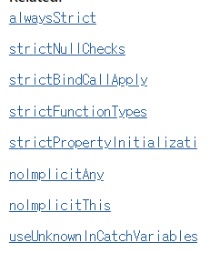
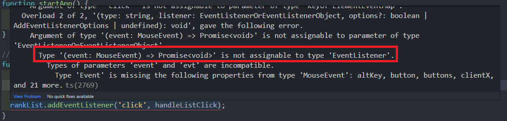
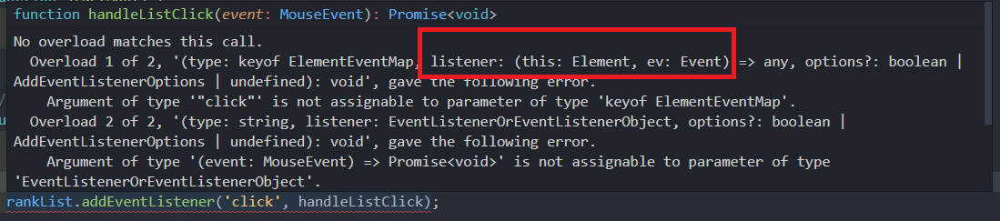

# 최종 프로젝트 - 엄격한 타입 적용

## 프로젝트 마지막 절차 안내 및 strict 옵션 적용

tsconfig.json으로 가보자.

```json
"strict": true
```

를 주게되면 strict와 관련된 모든 속성이 true가 된다.

저장 후 app.ts에 가게되면, 에러가 발생하는 것을 볼 수 있다.


## strict 옵션 소개

[strict 옵션 문서](https://www.typescriptlang.org/tsconfig#strict)

[strictNullCheck 옵션](https://www.typescriptlang.org/tsconfig#strictNullChecks)

옵션 문서에 들어가게되면, strict 옵션을 true로 주면 오른쪽에 나타나는 속성들이  true로 바뀌게 된다.



우리가 정의한 코드에서 좀 더 강하게 타입정의 할 수 있게 하나하나 점검하는 것.

추후에 일어날 수 있는 타입정의에 대한 오류에 대해서 미리 막을 수 있게 된다.

변경하게되면 ?

* any로 되있는 타입을 최대한 더 적절한 타입으로 변환함.
* as 와 같은 키워드를 최대한 사용하지 않도록 고민해서 변경함.


## null 타입 오류 및 함수 타입 오류 해결

중간쯤에 에러나는 것이 있을 것이다.

```typescript
function initEvents() {
  rankList.addEventListener('click', handleListClick);
}
```

rankList가 null일 수 있다. => null이면 addEvent를 호출 못하게 된다.는 에러.

null처리가 필요.

```typescript
if (!rankList) {
    return;
}
rankList.addEventListener('click', handleListClick);
```

null이 아니면 return시키면 rankList가 Element인게 추론된다.

하지만 여전히 에러가 발생할 것이다.

handleListClick의 모습과, addEventListener의 모습이 일치하지않아 에러가 발생.


우리가 tsconfig에서 strict를 true로 주면서, 아래 속성도 true가 되었다.

```json
"strictFunctionTypes"
```

이 속성은 함수의 타입까지 일치하는지 검사하는 속성이다.

[strictFunctionTypes 옵션](https://www.typescriptlang.org/tsconfig#strictFunctionTypes)


해결하려면?

addEventListener가 원하는 타입으로 정의를 해주어야한다.



Mouseevent는 Promise<void>가 호환이 안된다는 내용이 있다.




listener에 event: Event로 정의해야된다고 나와있다.

기존에는 호환이 된다고 생각하지만, strict를 추가했기 때문에 이와같이 정확한 타입을 넣어야된다.

```typescript
async function handleListClick(event: Event) { ... }
```

이처럼 수정하면 에러가 사라진다.


## 타입스크립트 내장 타입의 위계 구조 설명 및 타입 오류 해결

* Element
* HTMLElement
* HTMLDivElement

이와 같이 Element에도 위계가 있는 것을 배웠었다.

마찬가지로 이벤트도 존재한다.

```typescript
const evt1: Event
const evt2: UIEvent
const evt3: MouseEvent
```

각각 타고들어가면 확인할 수 있다.

결론적으로 Event 아래에 MouseEvent가 있다.


handleListClick을 보면 event.target.parentElement에 에러가 나있다.

해당 요소가 null일 수 있기 때문에 발생.

if안에 if를 쓰면 가독성이 떨어지니 삼항연산자를 사용하여 null 체크를 하자.

```typescript
selectedId = event.target.parentElement ? event.target.parentElement.id : undefined;
```


아래쪽 fetchCountryinfo를 사용한곳도 가보자.

```types
const { data: deathResponse } = await fetchCountryInfo(
    selectedId,
    CovidStatus.Deaths
  );
  const { data: recoveredResponse } = await fetchCountryInfo(
    selectedId,
    CovidStatus.Recovered
  );
  const { data: confirmedResponse } = await fetchCountryInfo(
    selectedId,
    CovidStatus.Confirmed
  );
```

selectedId가 string만 올 수 있게 되있어 에러 발생.

fetchCountryInfo에서 undefined도 붙이면 해결된다.

```typescript
function fetchCountryInfo(
  countryName: string | undefined,
  status: CovidStatus
): Promise<AxiosResponse<CountrySummaryResponse>> {
  // status params: confirmed, recovered, deaths
  const url = `https://api.covid19api.com/country/${countryName}/status/${status}`;
  return axios.get(url);
}
```


## 타입 단언을 이용한 타입 에러 해결

setDeathsList를 보면 아래쪽에 에러가 발생해있다.

deathsList가 Element거나 null인 것으로 추론되고 있다.

```typescript
if (!deathsList) { 
    return;
}
```

이런식으로 막을 순 있지만, 이렇게 되면 매번 써줘야한다.


type assertion을 사용해 null이 아닌 것이라 설정해 줄 수 있다.

```typescript
deathsList!.appendChild(li);
```

assertion을 쓰게되면 eslint에서 경고한다.


## 타입 단언 문법 사용시 주의해야 할 점

```typescript
interface Hero { 
  name: string,
  skill: string,
}

const capt: Hero = {
  name: 'hi',
  skill: 'shield',
}
```

이 경우 처음 부터 객체를 초기화할 때 값들을 가지고, 정의 했기 때문에 문제강 없다.


```typescript
const capt: Hero = {};
```

이렇게 되면 Hero라고 타입선언을 했지만, 안에 아무것도 없어 이건 타입에러라고 에러가 발생한다.


```typescript
const capt = {} as Hero;
capt.name = 'capt';
capt.skill = 'shield';
```

이 경우 에러는 발생하지 않는다.

처음 부터 초기 값을 정하지 않았기 때문에 충분히 이후에 정보 누락 등 에러가 발생할 수 있다.

따라서 주의하여 사용하여야 한다.

빈값으로 세팅해놓고 아까 위처럼 `a!`를 쓰게 되버리면  에러가 발생할 수 있다.

확실하게 확신이 있다면, 사용하면 좋다.


## null 타입 문제 해결

```typescript
function clearDeathList() {
  deathsList.innerHTML = null;
}
```

innerHTML에 null이 들어갈 수 없는데 null을 넣어 발생.


```typescript
function clearDeathList() {
  if (!deathsList) {
    return;
  }
  deathsList.innerHTML = '';
}
```


## 옵셔널 체이닝 연산자 소개

recoveredList가 null로 추론되고 있다.

```typescript
function setRecoveredList(data: CountrySummaryResponse) {
  ...
    recoveredList?.appendChild(li);
  });
}
```

저 물음표는 **옵셔널 체이닝 오퍼레이터(optional chaining operator)**라고 한다.

**특정 목적을 가진 연산자**라고 생각하면 된다.


위의 ?는 아래코드를 의미한다.

```typescript
if(recoveredList === null || recoveredList === undefined){ return; }
else{ recoveredList.appendChild(li) }
```

recoverdList가 null이거나 undefined면 return,

아니면 appendChild()를 실행한다. => recoveredChild가 Element인것을 볼 수 있다.


## DOM 유틸 함수 활용성을 높이는 타입 정의

```typescript
// DOM 접근함수.
function $(selector: string) {
  return document.querySelector(selector);
}
```

여기서 내가 어떤 값을 반환 받을 것이다 선언해보자.


```typescript
function $<T extends HTMLElement>(selector: string) {
  return document.querySelector(selector);
}

const temp = $<HTMLParagraphElement>{'.abc'}
```

접근함수에 Element의 하위함수만 받도록 extends로 제한


```typescript
function $<T extends HTMLElement>(selector: string) {
  const element = document.querySelector(selector);
  return element as T
}
```

타입 단언을 하여 리턴하면, 돔접근함수에 넘겼던 타입으로 반환할 수 있다.

```typescript
const confirmedTotal = $<HTMLSpanElement>('.confirmed-total');
```

이렇게 as로 되있던 부분들을 좀 더 보기 좋고, 제네릭을 이용한 구체적인 타입으로 수정할 수 있다.

주의할 점은 선택자가 오탈자가 나거나, 잘못 입력한 경우 잘못된 타입이 추론될 수도 있다.


```typescript
const temp = $('.abc');
```

이렇게 되면 temp는 기본값인 HTMLElement가 잡히고,  기본값까지 구체적으로 하고 싶다면

generic쪽에 default값을 정의할 수 있다.

```typescript
function $<T extends HTMLElement = HTMLDivElement>(selector: string) {
  const element = document.querySelector(selector);
  return element as T
}
```

